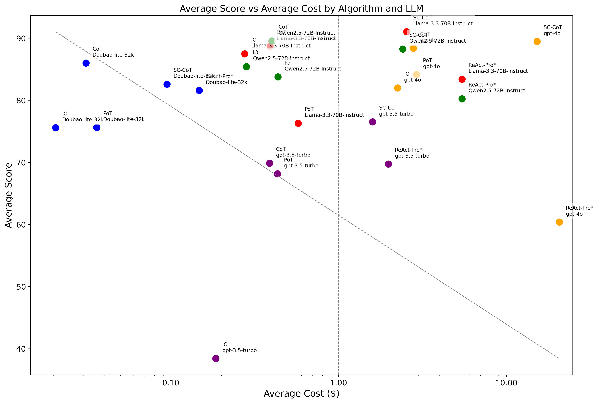

<div>
    <h1 align="center">🏅 Open Agent Leaderboard </h1>
</div>

<p align="center">
  <a href="https://huggingface.co/spaces/omlab/open-agent-leaderboard">🤗 HF Leaderboard
  </a>
</p>

##  🎉 Updates

- 2025/1/23: Add gpt-4o, Qwen2.5-72B-Instruct, Qwen2.5-7B-Instruct, Qwen2-1.5B-Instruct, Qwen2-0.5B-Instruct, Llama-3.3-70B-Instruct, Llama-3.1-8B-Instruct, Internllm2_5-7B into the leaderboard.
- 2025/1/07: The Open Agent Leaderboard is released.

## 📖 Introduction
This project aims to provide a fair comparison of various agents by evaluating their performance on different datasets and LLMs. Built on top of the [OmAgent](https://github.com/om-ai-lab/OmAgent) framework, it allows for simple, quick, and accurate assessments of agents.

Supported benchmark datasets:

- [gsm8k](https://huggingface.co/datasets/openai/gsm8k)
- [AQuA](https://github.com/google-deepmind/AQuA)

Supported algorithms:

- IO: Input-Output Direct Prompting (Baseline)
- [CoT: Chain-of-thought prompting elicits reasoning in large language models](https://arxiv.org/abs/2201.11903), [Large Language Models are Zero-Shot Reasoners](https://arxiv.org/pdf/2205.11916)
- [SC-CoT: Self-Consistency Improves Chain of Thought Reasoning in Language Models](https://arxiv.org/abs/2203.11171)
- [PoT: Program of thoughts prompting: Disentangling computation from reasoning for numerical reasoning tasks](https://arxiv.org/abs/2211.12588)
- [ReAct: ReAct: Synergizing Reasoning and Acting in Language Models](https://arxiv.org/abs/2210.03629)

Supported LLMs:

- gpt-3.5-turbo
- gpt-4o
- Doubao-lite-32k
- Qwen2.5-72B-Instruct
- Qwen2.5-7B-Instruct
- Qwen2-1.5B-Instruct
- Qwen2-0.5B-Instruct
- Llama-3.3-70B-Instruct
- Llama-3.1-8B-Instruct
- Internllm2_5-7B


## 🏅 Leaderboards

**Math tasks**

| **Rank** | **Algorithm** | **Eval Time** |     **LLM**     | **Average** | **gsm8k-score** | **gsm8k-cost($)** | **AQuA-score** | **AQuA-cost($)** |
| :------: | :-----------: | :-----------: | :-------------: | :---------: | :-------------: | :---------------: | :------------: | :--------------: |
| **1**    | SC-CoT     | Llama-3.3-70B-Instruct | 2025/1/22 | 91.03     | 95.45       | 4.5021        | 86.61      | 0.5847       |
| **2**    | CoT        | Qwen2.5-72B-Instruct   | 2025/1/22 | 89.55     | 92.87       | 0.7195        | 86.22      | 0.0808       |
| **3**    | CoT        | Llama-3.3-70B-Instruct | 2025/1/22 | 88.7      | 93.93       | 0.687         | 83.46      | 0.0927       |
| **4**    | CoT        | gpt-4o                 | 2025/1/22 | 88.38     | 94.08       | 4.5367        | 82.67      | 1.0417       |
| **5**    | SC-CoT     | Qwen2.5-72B-Instruct   | 2025/1/22 | 88.25     | 90.67       | 4.2651        | 85.82      | 0.5576       |
| **6**    | SC-CoT     | gpt-4o                 | 2025/1/22 | 88.24     | 91.05       | 35.8006       | 85.43      | 6.3449       |
| **7**    | IO         | Llama-3.3-70B-Instruct | 2025/1/22 | 87.47     | 92.26       | 0.4709        | 82.67      | 0.0798       |
| **8**    | SC-CoT     | Doubao-lite-32k        | 2025/1/7  | 86.04     | 88.62       | 0.1532        | 83.46      | 0.0409       |
| **9**    | CoT        | Doubao-lite-32k        | 2025/1/7  | 85.99     | 89.31       | 0.0558        | 82.67      | 0.0066       |
| **10**   | IO         | Qwen2.5-72B-Instruct   | 2025/1/22 | 85.42     | 86.58       | 0.4899        | 84.25      | 0.0742       |
| **11**   | SC-CoT     | Qwen2.5-7B-Instruct    | 2025/1/22 | 84.91     | 88.32       | 0             | 81.49      | 0            |
| **12**   | PoT        | gpt-4o                 | 2025/1/22 | 84.15     | 93.1        | 4.2166        | 75.19      | 1.6087       |
| **13**   | PoT        | Qwen2.5-72B-Instruct   | 2025/1/22 | 83.77     | 92.34       | 0.7054        | 75.19      | 0.1645       |
| **14**   | ReAct-Pro* | Llama-3.3-70B-Instruct | 2025/1/22 | 83.39     | 87.64       | 10.1124       | 79.13      | 0.768        |
| **15**   | CoT        | Qwen2.5-7B-Instruct    | 2025/1/22 | 83.19     | 85.67       | 0             | 80.7       | 0            |
| **16**   | IO         | gpt-4o                 | 2025/1/22 | 82        | 88.4        | 3.3463        | 75.59      | 1.1453       |
| **17**   | ReAct-Pro* | Doubao-lite-32k        | 2025/1/7  | 81.57     | 85.59       | 0.2512        | 77.55      | 0.0445       |
| **18**   | ReAct-Pro* | Qwen2.5-72B-Instruct   | 2025/1/22 | 80.24     | 87.26       | 10.5479       | 73.22      | 0.3177       |
| **19**   | ReAct-Pro* | Qwen2.5-7B-Instruct    | 2025/1/22 | 78.63     | 82.86       | 0             | 74.4       | 0            |
| **20**   | PoT        | Llama-3.3-70B-Instruct | 2025/1/22 | 76.3      | 73.08       | 0.9736        | 79.52      | 0.1746       |
| **21**   | PoT        | Doubao-lite-32k        | 2025/1/7  | 75.63     | 79.6        | 0.0576        | 71.65      | 0.0147       |
| **22**   | IO         | Doubao-lite-32k        | 2025/1/7  | 75.58     | 72.02       | 0.0354        | 79.13      | 0.0058       |
| **23**   | SC-CoT     | gpt-3.5-turbo          | 2025/1/7  | 73.69     | 80.06       | 5.0227        | 67.32      | 0.6491       |
| **24**   | ReAct-Pro* | gpt-3.5-turbo          | 2025/1/7  | 69.73     | 74.9        | 3.4633        | 64.56      | 0.4928       |
| **25**   | PoT        | gpt-3.5-turbo          | 2025/1/7  | 68.16     | 76.87       | 0.6902        | 59.44      | 0.1748       |
| **26**   | CoT        | Llama-3.1-8B-Instruct  | 2025/1/22 | 68.03     | 75.43       | 0             | 60.62      | 0            |
| **27**   | IO         | Qwen2.5-7B-Instruct    | 2025/1/22 | 67.99     | 57.24       | 0             | 78.74      | 0            |
| **28**   | CoT        | Internllm2_5-7B        | 2025/1/22 | 65.23     | 77.71       | 0             | 52.75      | 0            |
| **29**   | SC-CoT     | Llama-3.1-8B-Instruct  | 2025/1/22 | 64.17     | 75.2        | 0             | 53.14      | 0            |
| **30**   | PoT        | Qwen2.5-7B-Instruct    | 2025/1/22 | 63.47     | 58.83       | 0             | 68.11      | 0            |
| **31**   | ReAct-Pro* | Llama-3.1-8B-Instruct  | 2025/1/22 | 61.64     | 67.77       | 0             | 55.51      | 0            |
| **32**   | ReAct-Pro* | gpt-4o                 | 2025/1/22 | 60.39     | 63.3        | 39.0751       | 57.48      | 2.304        |
| **33**   | IO         | Llama-3.1-8B-Instruct  | 2025/1/22 | 54.17     | 57.16       | 0             | 51.18      | 0            |
| **34**   | CoT        | Qwen2-1.5B-Instruct    | 2025/1/22 | 48.02     | 55.49       | 0             | 40.55      | 0            |
| **35**   | CoT        | gpt-3.5-turbo          | 2025/1/7  | 39.35     | 78.69       | 0.6788        | 0          | 0            |
| **36**   | SC-CoT     | Internllm2_5-7B        | 2025/1/22 | 38.62     | 41.39       | 0             | 35.85      | 0            |
| **37**   | IO         | gpt-3.5-turbo          | 2025/1/7  | 38.4      | 37.83       | 0.3328        | 38.97      | 0.038        |
| **38**   | PoT        | Llama-3.1-8B-Instruct  | 2025/1/22 | 37.64     | 38.66       | 0             | 36.61      | 0            |
| **39**   | PoT        | Internllm2_5-7B        | 2025/1/22 | 37.41     | 38.21       | 0             | 36.61      | 0            |
| **40**   | ReAct-Pro* | Internllm2_5-7B        | 2025/1/22 | 37.23     | 33.51       | 0             | 40.94      | 0            |
| **41**   | CoT        | Qwen2-0.5B-Instruct    | 2025/1/22 | 34.5      | 35.93       | 0             | 33.07      | 0            |
| **42**   | IO         | Internllm2_5-7B        | 2025/1/22 | 29.61     | 11.59       | 0             | 47.63      | 0            |
| **43**   | ReAct-Pro* | Qwen2-1.5B-Instruct    | 2025/1/22 | 25.23     | 24.86       | 0             | 25.59      | 0            |
| **44**   | PoT        | Qwen2-1.5B-Instruct    | 2025/1/22 | 24.6      | 18.49       | 0             | 30.7       | 0            |
| **45**   | IO         | Qwen2-1.5B-Instruct    | 2025/1/22 | 22.9      | 16.67       | 0             | 29.13      | 0            |
| **46**   | IO         | Qwen2-0.5B-Instruct    | 2025/1/22 | 20.93     | 14.7        | 0             | 27.16      | 0            |
| **47**   | SC-CoT     | Qwen2-1.5B-Instruct    | 2025/1/22 | 17.92     | 5.53        | 0             | 30.31      | 0            |
| **48**   | SC-CoT     | Qwen2-0.5B-Instruct    | 2025/1/22 | 17.25     | 3.79        | 0             | 30.7       | 0            |
| **49**   | ReAct-Pro* | Qwen2-0.5B-Instruct    | 2025/1/22 | 15.83     | 7.65        | 0             | 24.01      | 0            |
| **50**   | PoT        | Qwen2-0.5B-Instruct    | 2025/1/22 | 13.47     | 9.62        | 0             | 17.32      | 0            |


Evaluation details can be found in the [Evaluation Details](#evaluation-details) section and [huggingface leaderboard](https://huggingface.co/spaces/omlab/open-agent-leaderboard).

- IO (Input-Output) is the baseline method that directly prompts the model with the question and expects an answer without any intermediate reasoning steps. It represents the most basic way of using language models and serves as a reference point for evaluating the effectiveness of other algorithms.

- ReAct-Pro*: We modified ReAct to ReAct-Pro, following the [Reflexion](https://github.com/noahshinn/reflexion) repository. Comparasion with the original ReAct repo can be found in the [Compare to ReAct](#comparison-react-with-react-pro) section.



## 🛠️ How to Install

1. Clone the repository:

   ```bash
   git clone https://github.com/om-ai-lab/open-agent-leaderboard.git
   cd open-agent-leaderboard
   ```
2. Install dependencies:

   ```bash
   pip install -r requirements.txt
   ```

## 🏗️ How to Evaluate Agents

### Step 1. Implement your agent in the  [`omagent`](https://github.com/om-ai-lab/OmAgent)  repository

Navigate to the agent repository:

    git clone https://github.com/om-ai-lab/OmAgent.git
    cd OmAgent

Set up the environment:

    pip install -e omagent-core

Implement your agent in the  [`omagent`](https://github.com/om-ai-lab/OmAgent)  repository, check the `examples/cot` folder.

### Step 2. Inference in OmAgent Repository

Run the inference script (cot as an example):

    cd examples/cot
    python eval_demo.py --model_id your_model_id --dataset_name your_dataset_name --dataset_path your_dataset_path --output_path your_output_path --output_name your_output_name --cot_method your_cot_method

#### Output Format

The output results are saved in JSON format and include the following fields:

- `id`: The unique identifier of the sample.
- `question`: The input question provided to the model.
- `last_output`: The raw output generated by the model.
- `output_postprocess` (optional): The processed output after cleansing.
- `ground_truth` (optional): The correct answer for the sample.
- `prompt_tokens`: The number of tokens in the input prompt.
- `completion_tokens`: The number of tokens in the model's output.

Example of an output JSON file:

```json
{
    "dataset": "gsm8k",
    "model_id": "gpt-3.5-turbo",
    "alg": "COT",
    "model_result": [
        {
            "id": 1,
            "question": "Q: There are 15 trees in the grove. Grove workers will plant trees in the grove today.....",
            "last_output": "Janet's ducks lay 16 eggs per day. She eats 3 for breakfast and uses 4 to bake muffins,...",
            "output_postprocess": "Paris",
            "ground_truth": "Paris",
            "prompt_tokens": 10,
            "completion_tokens": 5
        }
    ]
}
```

### Step 3. Evaluate inference results

Run the main script to perform evaluations:

```bash
python main.py --dataset <dataset_name> --model <model_name> --method <method_name> --output_dir <output_directory>
```

#### Parameters

- `--random_seed`: Random seed, default is 1.
- `--dataset`: Dataset to use, options are `aqua`, `gsm8k`.
- `--minibatch_size`: Minibatch size, default is 1.
- `--max_num_worker`: Maximum number of workers for the data loader, default is 4.
- `--model`: Model used for decoding, options are `gpt-4o-mini`, `gpt-4o`, `gpt-3.5-turbo`.
- `--method`: Method, options are `zero_shot`, `zero_shot_cot`, `few_shot`, `few_shot_cot`.
- `--cot_trigger_no`: Trigger sentence number for chain of thought, default is 1.
- `--max_length`: Maximum length of model output, default is 2048.
- `--max_length_direct`: Maximum length of direct model answer, default is 32.
- `--limit_dataset_size`: Whether to limit the test dataset size, default is 0 (no limit).
- `--output_dir`: Output directory, default is `./outputs/`.
- `--output_path`: Output path, default is empty.
- `--agent`: Agent used for the experiment, options are `cot`, `pot`, `sc_cot`, `react`.
- `--system_prompt`: System prompt, default is empty.
- `--openai_api_key`: OpenAI API key, default is empty.
- `--openai_url`: OpenAI API URL, default is `https://api.openai.com/v1`.

#### Example

```bash
python main.py --output_path example/gsm8k_results_cot.json --dataset gsm8k --method few_shot_cot
```

### Evaluation details

| **Algorithm** | **Dataset** | **Eval Time** |       LLM       | **Score** | **Pass Rate*** | **X-shot** |      **Parameters**       | **Samples** | **Total input tokens** | **Average input tokens** | **Total output tokens** | **Average output tokens** | **All tokens** | **Cost ($)** |
| :-----------: | :---------: | :-----------: | :-------------: | :-------: | :------------: | :--------: | :-----------------------: | :---------: | :--------------------: | :----------------------: | :---------------------: | :-----------------------: | :------------: | :----------: |
| **IO**         | gsm8k   | 2025/1/7  | gpt-3.5-turbo          | 37.83 | 99.92     | 8      |                           | 1319    | 546,990            | 415                  | 39,563              | 30                    | 586,553    | 0.3328  |
| **IO**         | gsm8k   | 2025/1/7  | Doubao-lite-32k        | 72.02 | 99.92     | 8      |                           | 1319    | 617,377            | 468                  | 123,106             | 93                    | 740,483    | 0.0354  |
| **IO**         | gsm8k   | 2025/1/22 | gpt-4o                 | 88.4  | 100       | 8      |                           | 1319    | 542,416            | 411                  | 199,030             | 151                   | 741,446    | 3.3463  |
| **IO**         | gsm8k   | 2025/1/22 | Qwen2.5-72B-Instruct   | 86.58 | 100       | 8      |                           | 1319    | 555,340            | 421                  | 313,720             | 238                   | 869,060    | 0.4899  |
| **IO**         | gsm8k   | 2025/1/22 | Llama-3.3-70B-Instruct | 92.27 | 100       | 8      |                           | 1319    | 583,916            | 443                  | 251,359             | 191                   | 835,275    | 0.4709  |
| **IO**         | gsm8k   | 2025/1/22 | Qwen2.5-7B-Instruct    | 57.24 | 100       | 8      |                           | 1319    | 596,229            | 452                  | 291,684             | 221                   | 887,913    | 0.0000  |
| **IO**         | gsm8k   | 2025/1/22 | Llama-3.1-8B-Instruct  | 57.16 | 99.55     | 8      |                           | 1319    | 550,941            | 418                  | 1,194,488           | 906                   | 1,745,429  | 0.0000  |
| **IO**         | gsm8k   | 2025/1/22 | Internllm2_5-7B        | 11.6  | 97.95     | 8      |                           | 1319    | 679,302            | 515                  | 434,426             | 329                   | 1,113,728  | 0.0000  |
| **IO**         | gsm8k   | 2025/1/22 | Qwen2-1.5B-Instruct    | 16.68 | 100       | 8      |                           | 1319    | 568,530            | 431                  | 168,466             | 128                   | 736,996    | 0.0000  |
| **IO**         | gsm8k   | 2025/1/22 | Qwen2-0.5B-Instruct    | 14.71 | 100       | 8      |                           | 1319    | 568,116            | 431                  | 266,781             | 202                   | 834,897    | 0.0000  |
| **ReAct-Pro*** | gsm8k   | 2025/1/7  | gpt-3.5-turbo          | 74.91 | 99.39     | 8      | max_steps=10              | 1319    | 6,506,164          | 4,933                | 140,122             | 106                   | 6,646,286  | 3.4633  |
| **ReAct-Pro*** | gsm8k   | 2025/1/7  | Doubao-lite-32k        | 85.6  | 99.62     | 8      | max_steps=10              | 1319    | 5,862,016          | 4,444                | 136,623             | 104                   | 5,998,639  | 0.2512  |
| **ReAct-Pro*** | gsm8k   | 2025/1/22 | gpt-4o                 | 63.31 | 99.55     | 8      | max_steps=10              | 1319    | 14,411,173         | 10,926               | 304,714             | 231                   | 14,715,887 | 39.0751 |
| **ReAct-Pro*** | gsm8k   | 2025/1/22 | Qwen2.5-72B-Instruct   | 87.26 | 100       | 8      | max_steps=10              | 1319    | 18,160,983         | 13,769               | 549,454             | 417                   | 18,710,437 | 10.5479 |
| **ReAct-Pro*** | gsm8k   | 2025/1/22 | Llama-3.3-70B-Instruct | 87.64 | 99.92     | 8      | max_steps=10              | 1319    | 17,038,928         | 12,918               | 898,936             | 682                   | 17,937,864 | 10.1124 |
| **ReAct-Pro*** | gsm8k   | 2025/1/22 | Qwen2.5-7B-Instruct    | 82.87 | 100       | 8      | max_steps=10              | 1319    | 14,355,752         | 10,884               | 495,162             | 375                   | 14,850,914 | 0.0000  |
| **ReAct-Pro*** | gsm8k   | 2025/1/22 | Llama-3.1-8B-Instruct  | 67.78 | 98.56     | 8      | max_steps=10              | 1319    | 21,044,978         | 15,955               | 1,790,789           | 1,358                 | 22,835,767 | 0.0000  |
| **ReAct-Pro*** | gsm8k   | 2025/1/22 | Internllm2_5-7B        | 33.51 | 97.95     | 8      | max_steps=10              | 1319    | 30,120,070         | 22,836               | 5,549,919           | 4,208                 | 35,669,989 | 0.0000  |
| **ReAct-Pro*** | gsm8k   | 2025/1/22 | Qwen2-1.5B-Instruct    | 24.87 | 80.21     | 8      | max_steps=10              | 1319    | 9,133,603          | 6,925                | 694,398             | 526                   | 9,828,001  | 0.0000  |
| **ReAct-Pro*** | gsm8k   | 2025/1/22 | Qwen2-0.5B-Instruct    | 7.66  | 95.22     | 8      | max_steps=10              | 1319    | 52,431,343         | 39,751               | 2,961,268           | 2,245                 | 55,392,611 | 0.0000  |
| **PoT**        | gsm8k   | 2025/1/7  | gpt-3.5-turbo          | 76.88 | 99.24     | 8      |                           | 1319    | 1,090,418          | 827                  | 96,662              | 73                    | 1,187,080  | 0.6902  |
| **PoT**        | gsm8k   | 2025/1/7  | Doubao-lite-32k        | 79.61 | 92.57     | 8      |                           | 1319    | 1,170,038          | 887                  | 118,017             | 89                    | 1,288,055  | 0.0576  |
| **PoT**        | gsm8k   | 2025/1/22 | gpt-4o                 | 93.1  | 99.77     | 8      |                           | 1319    | 1,101,672          | 835                  | 146,240             | 111                   | 1,247,912  | 4.2166  |
| **PoT**        | gsm8k   | 2025/1/22 | Qwen2.5-72B-Instruct   | 92.34 | 99.39     | 8      |                           | 1319    | 1,106,682          | 839                  | 144,528             | 110                   | 1,251,210  | 0.7054  |
| **PoT**        | gsm8k   | 2025/1/22 | Llama-3.3-70B-Instruct | 73.09 | 79.61     | 8      |                           | 1319    | 1,126,025          | 854                  | 601,019             | 456                   | 1,727,044  | 0.9736  |
| **PoT**        | gsm8k   | 2025/1/22 | Qwen2.5-7B-Instruct    | 58.83 | 70.51     | 8      |                           | 1319    | 1,145,390          | 868                  | 217,432             | 165                   | 1,362,822  | 0.0000  |
| **PoT**        | gsm8k   | 2025/1/22 | Llama-3.1-8B-Instruct  | 38.67 | 55.42     | 8      |                           | 1319    | 1,147,538          | 870                  | 243,573             | 185                   | 1,391,111  | 0.0000  |
| **PoT**        | gsm8k   | 2025/1/22 | Internllm2_5-7B        | 38.21 | 48.9      | 8      |                           | 1319    | 1,136,843          | 862                  | 188,106             | 143                   | 1,324,949  | 0.0000  |
| **PoT**        | gsm8k   | 2025/1/22 | Qwen2-1.5B-Instruct    | 18.5  | 31.01     | 8      |                           | 1319    | 1,151,528          | 873                  | 175,994             | 133                   | 1,327,522  | 0.0000  |
| **PoT**        | gsm8k   | 2025/1/22 | Qwen2-0.5B-Instruct    | 9.62  | 16.9      | 8      |                           | 1319    | 1,151,528          | 873                  | 237,607             | 180                   | 1,389,135  | 0.0000  |
| **CoT**        | gsm8k   | 2025/1/7  | gpt-3.5-turbo          | 78.7  | 100       | 8      |                           | 1319    | 953,242            | 723                  | 134,799             | 102                   | 1,088,041  | 0.6788  |
| **CoT**        | gsm8k   | 2025/1/7  | Doubao-lite-32k        | 89.31 | 100       | 8      |                           | 1319    | 1,042,095          | 790                  | 159,725             | 121                   | 1,201,820  | 0.0558  |
| **CoT**        | gsm8k   | 2025/1/22 | gpt-4o                 | 94.09 | 100       | 8      |                           | 1319    | 948,668            | 719                  | 216,498             | 164                   | 1,165,166  | 4.5367  |
| **CoT**        | gsm8k   | 2025/1/22 | Qwen2.5-72B-Instruct   | 92.87 | 100       | 8      |                           | 1319    | 1,005,119          | 762                  | 271,133             | 206                   | 1,276,252  | 0.7195  |
| **CoT**        | gsm8k   | 2025/1/22 | Llama-3.3-70B-Instruct | 93.93 | 100       | 8      |                           | 1319    | 990,168            | 751                  | 228,497             | 173                   | 1,218,665  | 0.6870  |
| **CoT**        | gsm8k   | 2025/1/22 | Qwen2.5-7B-Instruct    | 85.67 | 100       | 8      |                           | 1319    | 1,046,008          | 793                  | 244,797             | 186                   | 1,290,805  | 0.0000  |
| **CoT**        | gsm8k   | 2025/1/22 | Llama-3.1-8B-Instruct  | 75.44 | 99.92     | 8      |                           | 1319    | 990,168            | 751                  | 258,161             | 196                   | 1,248,329  | 0.0000  |
| **CoT**        | gsm8k   | 2025/1/22 | Internllm2_5-7B        | 77.71 | 99.7      | 8      |                           | 1319    | 968,163            | 734                  | 234,000             | 177                   | 1,202,163  | 0.0000  |
| **CoT**        | gsm8k   | 2025/1/22 | Qwen2-1.5B-Instruct    | 55.5  | 100       | 8      |                           | 1319    | 1,032,818          | 783                  | 185,707             | 141                   | 1,218,525  | 0.0000  |
| **CoT**        | gsm8k   | 2025/1/22 | Qwen2-0.5B-Instruct    | 35.94 | 99.92     | 8      |                           | 1319    | 1,032,818          | 783                  | 190,641             | 145                   | 1,223,459  | 0.0000  |
| **SC-CoT**     | gsm8k   | 2025/1/7  | gpt-3.5-turbo          | 82.56 | 99.85     | 8      | temperature=1, path_num=5 | 1319    | 1,212,520          | 919                  | 1,348,177           | 1,022                 | 2,560,697  | 2.6285  |
| **SC-CoT**     | gsm8k   | 2025/1/7  | Doubao-lite-32k        | 83.7  | 99.7      | 8      | temperature=1, path_num=5 | 1319    | 1,230,019          | 933                  | 1,277,668           | 969                   | 2,507,687  | 0.1550  |
| **SC-CoT**     | gsm8k   | 2025/1/22 | gpt-4o                 | 90.75 | 100       | 8      | temperature=1, path_num=5 | 1319    | 1,168,927          | 886                  | 2,132,044           | 1,616                 | 3,300,971  | 24.2428 |
| **SC-CoT**     | gsm8k   | 2025/1/22 | Qwen2.5-72B-Instruct   | 90.67 | 100       | 8      | temperature=1, path_num=5 | 1319    | 5,292,383          | 4,012                | 2,273,254           | 1,723                 | 7,565,637  | 4.2651  |
| **SC-CoT**     | gsm8k   | 2025/1/22 | Llama-3.3-70B-Instruct | 95.45 | 100       | 8      | temperature=1, path_num=5 | 1319    | 5,406,763          | 4,099                | 2,579,233           | 1,955                 | 7,985,996  | 4.5021  |
| **SC-CoT**     | gsm8k   | 2025/1/22 | Qwen2.5-7B-Instruct    | 88.32 | 99.85     | 8      | temperature=1, path_num=5 | 1319    | 5,668,252          | 4,297                | 2,505,566           | 1,900                 | 8,173,818  | 0.0000  |
| **SC-CoT**     | gsm8k   | 2025/1/22 | Llama-3.1-8B-Instruct  | 75.21 | 99.55     | 8      | temperature=1, path_num=5 | 1319    | 5,334,657          | 4,044                | 3,109,546           | 2,358                 | 8,444,203  | 0.0000  |
| **SC-CoT**     | gsm8k   | 2025/1/22 | Internllm2_5-7B        | 41.39 | 98.26     | 8      | temperature=1, path_num=5 | 1319    | 6,674,518          | 5,060                | 3,350,339           | 2,540                 | 10,024,857 | 0.0000  |
| **SC-CoT**     | gsm8k   | 2025/1/22 | Qwen2-1.5B-Instruct    | 5.53  | 86.73     | 8      | temperature=1, path_num=5 | 1319    | 5,844,218          | 4,431                | 3,117,550           | 2,364                 | 8,961,768  | 0.0000  |
| **SC-CoT**     | gsm8k   | 2025/1/22 | Qwen2-0.5B-Instruct    | 3.79  | 94.84     | 8      | temperature=1, path_num=5 | 1319    | 6,529,832          | 4,951                | 4,003,983           | 3,036                 | 10,533,815 | 0.0000  |
| **IO**         | AQuA    | 2025/1/7  | gpt-3.5-turbo          | 38.98 | 100       | 0      |                           | 254     | 25,701             | 101                  | 16,770              | 66                    | 42,471     | 0.0380  |
| **IO**         | AQuA    | 2025/1/7  | Doubao-lite-32k        | 79.13 | 100       | 0      |                           | 254     | 33,058             | 130                  | 54,684              | 215                   | 87,742     | 0.0058  |
| **IO**         | AQuA    | 2025/1/22 | gpt-4o                 | 75.59 | 97.24     | 0      |                           | 254     | 25,631             | 101                  | 108,121             | 426                   | 133,752    | 1.1453  |
| **IO**         | AQuA    | 2025/1/22 | Qwen2.5-72B-Instruct   | 84.25 | 99.61     | 0      |                           | 254     | 25,397             | 100                  | 106,207             | 418                   | 131,604    | 0.0742  |
| **IO**         | AQuA    | 2025/1/22 | Llama-3.3-70B-Instruct | 82.68 | 99.21     | 0      |                           | 254     | 32,809             | 129                  | 108,758             | 428                   | 141,567    | 0.0798  |
| **IO**         | AQuA    | 2025/1/22 | Qwen2.5-7B-Instruct    | 78.74 | 98.43     | 0      |                           | 254     | 33,271             | 131                  | 104,500             | 411                   | 137,771    | 0.0000  |
| **IO**         | AQuA    | 2025/1/22 | Llama-3.1-8B-Instruct  | 51.18 | 98.82     | 0      |                           | 254     | 26,459             | 104                  | 106,647             | 420                   | 133,106    | 0.0000  |
| **IO**         | AQuA    | 2025/1/22 | Internllm2_5-7B        | 47.64 | 90.94     | 0      |                           | 254     | 50,232             | 198                  | 134,809             | 531                   | 185,041    | 0.0000  |
| **IO**         | AQuA    | 2025/1/22 | Qwen2-1.5B-Instruct    | 29.13 | 97.64     | 0      |                           | 254     | 27,937             | 110                  | 43,110              | 170                   | 71,047     | 0.0000  |
| **IO**         | AQuA    | 2025/1/22 | Qwen2-0.5B-Instruct    | 27.17 | 98.82     | 0      |                           | 254     | 27,937             | 110                  | 82,478              | 325                   | 110,415    | 0.0000  |
| **CoT**        | AQuA    | 2025/1/22 | gpt-3.5-turbo          | 61.02 | 93.7      | 0      |                           | 254     | 25,447             | 100                  | 55,346              | 218                   | 80,793     | 0.0957  |
| **CoT**        | AQuA    | 2025/1/7  | Doubao-lite-32k        | 82.68 | 97.24     | 0      |                           | 254     | 27,978             | 110                  | 66,599              | 262                   | 94,577     | 0.0066  |
| **CoT**        | AQuA    | 2025/1/22 | gpt-4o                 | 82.68 | 98.03     | 0      |                           | 254     | 25,123             | 99                   | 97,894              | 385                   | 123,017    | 1.0417  |
| **CoT**        | AQuA    | 2025/1/22 | Qwen2.5-72B-Instruct   | 86.22 | 99.21     | 0      |                           | 254     | 25,143             | 99                   | 118,146             | 465                   | 143,289    | 0.0808  |
| **CoT**        | AQuA    | 2025/1/22 | Llama-3.3-70B-Instruct | 83.46 | 98.43     | 0      |                           | 254     | 32,555             | 128                  | 131,834             | 519                   | 164,389    | 0.0927  |
| **CoT**        | AQuA    | 2025/1/22 | Qwen2.5-7B-Instruct    | 80.71 | 99.61     | 0      |                           | 254     | 33,017             | 130                  | 116,719             | 460                   | 149,736    | 0.0000  |
| **CoT**        | AQuA    | 2025/1/22 | Llama-3.1-8B-Instruct  | 60.63 | 100       | 0      |                           | 254     | 32,555             | 128                  | 111,880             | 440                   | 144,435    | 0.0000  |
| **CoT**        | AQuA    | 2025/1/22 | Internllm2_5-7B        | 52.76 | 89.37     | 0      |                           | 254     | 26,610             | 105                  | 100,910             | 397                   | 127,520    | 0.0000  |
| **CoT**        | AQuA    | 2025/1/22 | Qwen2-1.5B-Instruct    | 40.55 | 98.82     | 0      |                           | 254     | 30,477             | 120                  | 79,563              | 313                   | 110,040    | 0.0000  |
| **CoT**        | AQuA    | 2025/1/22 | Qwen2-0.5B-Instruct    | 33.07 | 98.82     | 0      |                           | 254     | 30,477             | 120                  | 86,862              | 342                   | 117,339    | 0.0000  |
| **PoT**        | AQuA    | 2025/1/7  | gpt-3.5-turbo          | 59.45 | 100       | 0      |                           | 254     | 225,162            | 886                  | 41,492              | 163                   | 266,654    | 0.1748  |
| **PoT**        | AQuA    | 2025/1/7  | Doubao-lite-32k        | 71.65 | 96.85     | 0      |                           | 254     | 259,863            | 1,023                | 49,573              | 195                   | 309,436    | 0.0147  |
| **PoT**        | AQuA    | 2025/1/22 | gpt-4o                 | 75.2  | 100       | 0      |                           | 254     | 222,717            | 877                  | 105,191             | 414                   | 327,908    | 1.6087  |
| **PoT**        | AQuA    | 2025/1/22 | Qwen2.5-72B-Instruct   | 75.2  | 100       | 0      |                           | 254     | 249,215            | 981                  | 42,549              | 168                   | 291,764    | 0.1645  |
| **PoT**        | AQuA    | 2025/1/22 | Llama-3.3-70B-Instruct | 79.53 | 99.21     | 0      |                           | 254     | 240,735            | 948                  | 69,064              | 272                   | 309,799    | 0.1746  |
| **PoT**        | AQuA    | 2025/1/22 | Qwen2.5-7B-Instruct    | 68.11 | 100       | 0      |                           | 254     | 264,517            | 1,041                | 49,211              | 194                   | 313,728    | 0.0000  |
| **PoT**        | AQuA    | 2025/1/22 | Llama-3.1-8B-Instruct  | 36.61 | 96.85     | 0      |                           | 254     | 240,613            | 947                  | 50,301              | 198                   | 290,914    | 0.0000  |
| **PoT**        | AQuA    | 2025/1/22 | Internllm2_5-7B        | 36.61 | 98.82     | 0      |                           | 254     | 233,505            | 919                  | 68,457              | 270                   | 301,962    | 0.0000  |
| **PoT**        | AQuA    | 2025/1/22 | Qwen2-1.5B-Instruct    | 30.71 | 96.46     | 0      |                           | 254     | 246,560            | 971                  | 51,915              | 204                   | 298,475    | 0.0000  |
| **PoT**        | AQuA    | 2025/1/22 | Qwen2-0.5B-Instruct    | 17.32 | 92.13     | 0      |                           | 254     | 258,867            | 1,019                | 63,414              | 250                   | 322,281    | 0.0000  |
| **SC-CoT**     | AQuA    | 2025/1/7  | gpt-3.5-turbo          | 70.47 | 98.82     | 0      | temperature=1, path_num=5 | 254     | 70,157             | 276                  | 348,460             | 1,372                 | 418,617    | 0.5578  |
| **SC-CoT**     | AQuA    | 2025/1/7  | Doubao-lite-32k        | 81.5  | 97.64     | 0      | temperature=1, path_num=5 | 254     | 83,830             | 330                  | 382,016             | 1,504                 | 465,846    | 0.0347  |
| **SC-CoT**     | AQuA    | 2025/1/22 | gpt-4o                 | 88.19 | 100       | 0      | temperature=1, path_num=5 | 254     | 72,916             | 287                  | 605,895             | 2,385                 | 678,811    | 6.2412  |
| **SC-CoT**     | AQuA    | 2025/1/22 | Qwen2.5-72B-Instruct   | 85.83 | 98.43     | 0      | temperature=1, path_num=5 | 254     | 241,149            | 949                  | 747,909             | 2,945                 | 989,058    | 0.5576  |
| **SC-CoT**     | AQuA    | 2025/1/22 | Llama-3.3-70B-Instruct | 86.61 | 99.21     | 0      | temperature=1, path_num=5 | 254     | 283,248            | 1,115                | 753,876             | 2,968                 | 1,037,124  | 0.5847  |
| **SC-CoT**     | AQuA    | 2025/1/22 | Qwen2.5-7B-Instruct    | 81.5  | 100       | 0      | temperature=1, path_num=5 | 254     | 278,848            | 1,098                | 736,520             | 2,900                 | 1,015,368  | 0.0000  |
| **SC-CoT**     | AQuA    | 2025/1/22 | Llama-3.1-8B-Instruct  | 53.15 | 96.06     | 0      | temperature=1, path_num=5 | 254     | 372,968            | 1,468                | 668,378             | 2,631                 | 1,041,346  | 0.0000  |
| **SC-CoT**     | AQuA    | 2025/1/22 | Internllm2_5-7B        | 35.85 | 98.8      | 0      | temperature=1, path_num=5 | 254     | 530,701            | 2,089                | 709,687             | 2,794                 | 1,240,388  | 0.0000  |
| **SC-CoT**     | AQuA    | 2025/1/22 | Qwen2-1.5B-Instruct    | 30.31 | 97.24     | 0      | temperature=1, path_num=5 | 254     | 430,703            | 1,696                | 726,373             | 2,860                 | 1,157,076  | 0.0000  |
| **SC-CoT**     | AQuA    | 2025/1/22 | Qwen2-0.5B-Instruct    | 30.71 | 98.43     | 0      | temperature=1, path_num=5 | 254     | 496,206            | 1,954                | 729,333             | 2,871                 | 1,225,539  | 0.0000  |
| **ReAct-Pro*** | AQuA    | 2025/1/7  | gpt-3.5-turbo          | 64.57 | 98.03     | 0      | max_steps=10              | 254     | 862,614            | 3,396                | 40,973              | 161                   | 903,587    | 0.4928  |
| **ReAct-Pro*** | AQuA    | 2025/1/7  | Doubao-lite-32k        | 77.56 | 96.06     | 0      | max_steps=10              | 254     | 977,890            | 3,850                | 54,951              | 216                   | 1,032,841  | 0.0445  |
| **ReAct-Pro*** | AQuA    | 2025/1/22 | gpt-4o                 | 57.48 | 97.24     | 0      | max_steps=10              | 254     | 615,589            | 2,424                | 76,507              | 301                   | 692,096    | 2.3040  |
| **ReAct-Pro*** | AQuA    | 2025/1/22 | Qwen2.5-72B-Instruct   | 73.23 | 100       | 0      | max_steps=10              | 254     | 441,765            | 1,739                | 121,838             | 480                   | 563,603    | 0.3177  |
| **ReAct-Pro*** | AQuA    | 2025/1/22 | Llama-3.3-70B-Instruct | 79.13 | 99.61     | 0      | max_steps=10              | 254     | 1,119,143          | 4,406                | 243,236             | 958                   | 1,362,379  | 0.7680  |
| **ReAct-Pro*** | AQuA    | 2025/1/22 | Qwen2.5-7B-Instruct    | 74.41 | 99.21     | 0      | max_steps=10              | 254     | 564,165            | 2,221                | 131,679             | 518                   | 695,844    | 0.0000  |
| **ReAct-Pro*** | AQuA    | 2025/1/22 | Llama-3.1-8B-Instruct  | 55.51 | 96.85     | 0      | max_steps=10              | 254     | 3,764,723          | 14,822               | 576,098             | 2,268                 | 4,340,821  | 0.0000  |
| **ReAct-Pro*** | AQuA    | 2025/1/22 | Internllm2_5-7B        | 40.94 | 96.85     | 0      | max_steps=10              | 254     | 3,592,039          | 14,142               | 836,762             | 3,294                 | 4,428,801  | 0.0000  |
| **ReAct-Pro*** | AQuA    | 2025/1/22 | Qwen2-1.5B-Instruct    | 25.59 | 96.06     | 0      | max_steps=10              | 254     | 4,555,858          | 17,936               | 516,146             | 2,032                 | 5,072,004  | 0.0000  |
| **ReAct-Pro*** | AQuA    | 2025/1/22 | Qwen2-0.5B-Instruct    | 24.02 | 96.85     | 0      | max_steps=10              | 254     | 6344167            | 24,977               | 825920              | 3,252                 | 7,170,087  | 0.0000  |


Default settings:

```
temperature = 0
```

LLM prices:

- LLM prices:
  - gpt-3.5-turbo: 
    - 0.5$/1M tokens (input)
    - 1.5$/1M tokens (output)
  - Doubao-lite-32k (1 USD = 7.3249 CNY): 
    - 0.04096$/1M tokens (input)
    - 0.08200$/1M tokens (output)
  - gpt-4o-2024-08-06:
    - 2.50$ /1M input tokens (input)
    - 10$ /1M output tokens (output)
  - Qwen2.5-7B-Instruct and Llama-3.3-70B-Instruct:
    - Prices can be found https://cloud.siliconflow.cn/.
  - Other open source LLMs:
    - Deployed locally, please check the [*OmAgent*](https://github.com/om-ai-lab/OmAgent) repository for more information.
    - Cost is not considered in the leaderboard.

Pass Rate*: The pass rate is calculated by evaluating the percentage of predictions that are valid, where a prediction is valid if it is neither empty nor null.

### Compare to original agent repositories

| **Algorithm** | **Dataset** | **Eval Time** |    **LLM**    | **Framework** | **Score** |
| :-----------: | :---------: | :-----------: | :-----------: | :-----------: | :-------: |
|    **CoT**    |    gsm8k    |   2025/1/7    | gpt-3.5-turbo | Original repo |   79.23   |
|    **CoT**    |    gsm8k    |   2025/1/7    | gpt-3.5-turbo |    OmAgent    |   78.70   |
|    **CoT**    |    AQuA     |   2025/1/7    | gpt-3.5-turbo | Original repo |   60.63   |
|    **CoT**    |    AQuA     |   2025/1/7    | gpt-3.5-turbo |    OmAgent    |   61.02   |
|    **PoT**    |    gsm8k    |   2025/1/7    |  gpt-4o-mini  | Original repo |   86.35   |
|    **PoT**    |    gsm8k    |   2025/1/7    |  gpt-4o-mini  |    OmAgent    |   88.25   |
|   **ReAct**   |    AQuA     |   2025/1/7    | gpt-3.5-turbo | Original repo |   35.04   |
|   **ReAct**   |    AQuA     |   2025/1/7    | gpt-3.5-turbo |    OmAgent    |   34.25   |
|   **ReAct**   |  HotpotQA   |   2025/1/8    | gpt-3.5-turbo | Original repo |   28.00   |
|   **ReAct**   |  HotpotQA   |   2025/1/8    | gpt-3.5-turbo |    OmAgent    |   27.40   |

Note:

- The original repo is the official repository of the agent implementation.
- OmAgent is the implementation of the agent in this project.
- There is no official implementation of SC-CoT.

### Comparison ReAct with ReAct-Pro

| **Algorithm** | **Dataset** | **Eval Time** |    **LLM**    | **Score** | **Pass Rate** |
| :-----------: | :---------: | :-----------: | :-----------: | :-------: | :-----------: |
|   **ReAct**   |    gsm8k    |   2025/1/7    | gpt-3.5-turbo |   38.13   |    100.00     |
| **ReAct-Pro** |    gsm8k    |   2025/1/7    | gpt-3.5-turbo |   74.91   |     99.39     |
|   **ReAct**   |    AQuA     |   2025/1/7    | gpt-3.5-turbo |   34.25   |     97.64     |
| **ReAct-Pro** |    AQuA     |   2025/1/7    | gpt-3.5-turbo |   64.57   |     98.03     |

## 🔗 Related works

Open Agent Leaderboard is built on top of the [OmAgent](https://github.com/om-ai-lab/OmAgent) repository.

Acknowledgments

We extend our deepest gratitude to the authors and contributors of the following datasets: gsm8k, AQuA, agent algorithms: CoT, SC-CoT, PoT, ReAct, and LLMs: gpt-3.5-turbo, Doubao-lite-32k.

## ⭐️ Citation

If you find our repository beneficial, please cite our repository:
```bibtex
@misc{open-agent-leaderboard,
    title={Open Agent Leaderboard},
    author={Om AI Lab},
    year={2025},
    publisher={GitHub},
    howpublished={\url{https://github.com/om-ai-lab/open-agent-leaderboard}}
}
```

## 🔔 Follow us
You can follow us on [X](https://x.com/OmAI_lab) and [Discord](https://discord.gg/G9n5tq4qfK) for more updates and discussions.  

## 🤝 Contributing

Feel free to submit issues and pull requests.

## 📝 License

This project is licensed under the MIT License.
