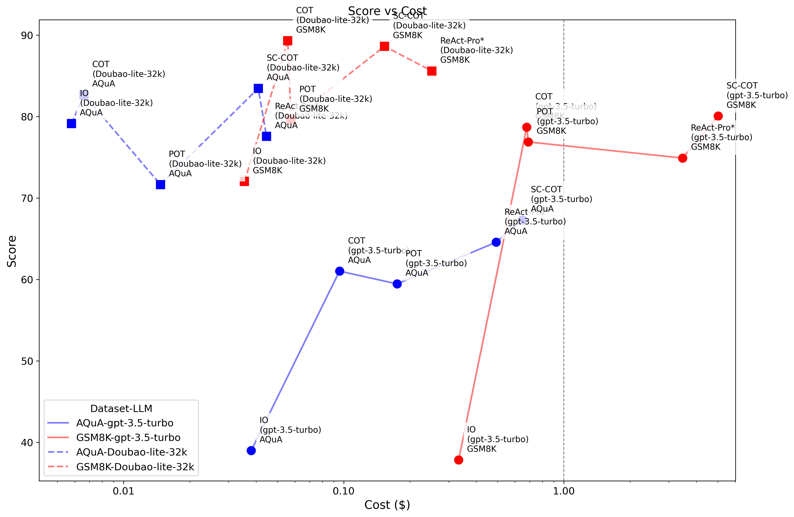

# Open Agent Leaderboard

This project aims to provide a fair comparison of various agents by evaluating their performance on different datasets and LLMs. Built on top of the [OmAgent](https://github.com/om-ai-lab/OmAgent) framework, it allows for simple, quick, and accurate assessments of agents.

Supported benchmark datasets:

- [gsm8k](https://huggingface.co/datasets/openai/gsm8k)
- [AQuA](https://github.com/google-deepmind/AQuA)

Supported algorithms:

- [COT: Chain-of-thought prompting elicits reasoning in large language models](https://arxiv.org/abs/2201.11903)
- [SC-COT: Self-Consistency Improves Chain of Thought Reasoning in Language Models](https://arxiv.org/abs/2203.11171)
- [POT: Program of thoughts prompting: Disentangling computation from reasoning for numerical reasoning tasks](https://arxiv.org/abs/2211.12588)
- [ReAct: ReAct: Synergizing Reasoning and Acting in Language Models](https://arxiv.org/abs/2210.03629)
- [DNC: OmAgent: A Multi-modal Agent Framework for Complex Video Understanding with Task Divide-and-Conquer](https://arxiv.org/abs/2406.16620)

Supported LLMs:

- gpt-3.5-turbo
- Doubao-lite-32k

## Leaderboards

**Math tasks**

| **Rank** | **Algorithm** | **Eval Time** |  **LLM**  | **Average** | **gsm8k-score** | **gsm8k-cost($)** | **AQuA-score** | **AQuA-cost($)** |
| :------------: | :-----------------: | :-----------------: | :-------------: | :---------------: | :-------------------: | :-----------------------------------------------------------: | :---: | :----: |
|  **10**  |         IO         |      2025/1/7      |  gpt-3.5-turbo  |       38.40       |         37.83         |                            0.3328                            | 38.98 | 0.0380 |
|  **6**  |         COT         |      2025/1/7      |  gpt-3.5-turbo  |       69.86       |         78.70         |                            0.6788                            | 61.02 | 0.0957 |
|  **5**  |       SC-COT       |      2025/1/7      |  gpt-3.5-turbo  |       73.69       |         80.06         |                            5.0227                            | 67.32 | 0.6491 |
|  **9**  |         POT         |      2025/1/7      |  gpt-3.5-turbo  |       64.42       |         76.88         |                            0.6902                            | 51.97 | 0.1557 |
|  **7**  |      ReAct-Pro*      |      2025/1/7      |  gpt-3.5-turbo  |       69.74       |         74.91         |                            3.4633                            | 64.57 | 0.4928 |
|  **4**  |         IO         |      2025/1/7      | Doubao-lite-32k |       75.58       |         72.02         |                            0.0354                            | 79.13 | 0.0058 |
|  **2**  |         COT         |      2025/1/7      | Doubao-lite-32k |       85.99       |         89.31         |                            0.0557                            | 82.68 | 0.0066 |
|  **1**  |       SC-COT       |      2025/1/7      | Doubao-lite-32k |       86.05       |         88.63         |                            0.1533                            | 83.46 | 0.0409 |
|  **8**  |         POT         |      2025/1/7      | Doubao-lite-32k |       65.76       |         79.15         |                            0.0575                            | 52.36 | 0.0142 |
|  **3**  |      ReAct-Pro*      |      2025/1/7      | Doubao-lite-32k |       81.58       |         85.60         |                            0.2513                            | 77.56 | 0.0446 |

Evaluation details can be found in the [Evaluation Details](#evaluation-details) section.

ReAct-Pro*: We improved ReAct to ReAct-Pro, following the [Reflexion](https://github.com/noahshinn/reflexion) repository. Comparasion with the original ReAct repo can be found in the [Compare to ReAct](#comparison-react-with-react-pro) section.



## How to Install

1. Clone the repository:

   ```bash
   git clone https://github.com/om-ai-lab/open-agent-leaderboard.git
   cd open-agent-leaderboard
   ```
2. Install dependencies:

   ```bash
   pip install -r requirements.txt
   ```

## How to Evaluate Agents

### Step 1. Implement your agent in the  [`omagent`](https://github.com/om-ai-lab/OmAgent)  repository

Navigate to the agent repository:

    git clone https://github.com/om-ai-lab/OmAgent.git
    cd OmAgent

Set up the environment:

    pip install -e omagent-core

Implement your agent in the  [`omagent`](https://github.com/om-ai-lab/OmAgent)  repository, check the `examples/cot` folder.

### Step 2. Inference in OmAgent Repository

Run the inference script (cot as an example):

    cd examples/cot
    python eval_demo.py --model_id your_model_id --dataset_name your_dataset_name --dataset_path your_dataset_path --output_path your_output_path --output_name your_output_name --cot_method your_cot_method

#### Output Format

The output results are saved in JSON format and include the following fields:

- `id`: The unique identifier of the sample.
- `question`: The input question provided to the model.
- `last_output`: The raw output generated by the model.
- `output_postprocess` (optional): The processed output after cleansing.
- `ground_truth` (optional): The correct answer for the sample.
- `prompt_tokens`: The number of tokens in the input prompt.
- `completion_tokens`: The number of tokens in the model's output.

Example of an output JSON file:

```json
{
    "dataset": "gsm8k",
    "model_id": "gpt-3.5-turbo",
    "alg": "COT",
    "model_result": [
        {
            "id": 1,
            "question": "Q: There are 15 trees in the grove. Grove workers will plant trees in the grove today.....",
            "last_output": "Janet's ducks lay 16 eggs per day. She eats 3 for breakfast and uses 4 to bake muffins,...",
            "output_postprocess": "Paris",
            "ground_truth": "Paris",
            "prompt_tokens": 10,
            "completion_tokens": 5
        }
    ]
}
```

### Step 3. Evaluate inference results

Run the main script to perform evaluations:

```bash
python main.py --dataset <dataset_name> --model <model_name> --method <method_name> --output_dir <output_directory>
```

#### Parameters

- `--random_seed`: Random seed, default is 1.
- `--dataset`: Dataset to use, options are `aqua`, `gsm8k`.
- `--minibatch_size`: Minibatch size, default is 1.
- `--max_num_worker`: Maximum number of workers for the data loader, default is 4.
- `--model`: Model used for decoding, options are `gpt-4o-mini`, `gpt-4o`, `gpt-3.5-turbo`.
- `--method`: Method, options are `zero_shot`, `zero_shot_cot`, `few_shot`, `few_shot_cot`.
- `--cot_trigger_no`: Trigger sentence number for chain of thought, default is 1.
- `--max_length`: Maximum length of model output, default is 2048.
- `--max_length_direct`: Maximum length of direct model answer, default is 32.
- `--limit_dataset_size`: Whether to limit the test dataset size, default is 0 (no limit).
- `--output_dir`: Output directory, default is `./outputs/`.
- `--output_path`: Output path, default is empty.
- `--agent`: Agent used for the experiment, options are `cot`, `pot`, `sc_cot`, `react`, `dnc`.
- `--system_prompt`: System prompt, default is empty.
- `--openai_api_key`: OpenAI API key, default is empty.
- `--openai_url`: OpenAI API URL, default is `https://api.openai.com/v1`.

#### Example

```bash
python main.py --output_path example/gsm8k_results_cot.json --dataset gsm8k --method few_shot_cot
```

### Evaluation details

| **Algorithm** | **Dataset** | **Eval Time** |       LLM       | **Score** | **Pass Rete*** | **X-shot** |   **Parameters**   | **Samples** | **Total input tokens** | **Average input tokens** | **Total output tokens** | **Average output tokens** | **All tokens** | **Cost ($)** |
| :-----------------: | :---------------: | :-----------------: | :-------------: | :-------------: | :------------------: | :--------------: | :-----------------------: | :---------------: | :--------------------------: | :----------------------------: | :---------------------------: | :-----------------------------: | :------------------: | :----------------: |
|    **IO**    |       gsm8k       |      2025/1/7      |  gpt-3.5-turbo  |      37.83      |        99.92        |        8        |                          |       1319       |           546,990           |              415              |            39,563            |               30               |       586,553       |       0.3328       |
|    **IO**    |       gsm8k       |      2025/1/7      | Doubao-lite-32k |      72.02      |        99.92        |        8        |                          |       1319       |           617,377           |              468              |            123,106            |               93               |       740,483       |       0.0354       |
|    **COT**    |       gsm8k       |      2025/1/7      |  gpt-3.5-turbo  |      78.70      |        100.00        |        8        |                          |       1319       |           953,242           |              723              |            134,799            |               102               |      1,088,041      |       0.6788       |
|    **COT**    |       gsm8k       |      2025/1/7      | Doubao-lite-32k |      89.31      |        100.00        |        8        |                          |       1319       |          1,042,095          |              790              |            159,725            |               121               |      1,201,820      |       0.0557       |
|  **SC-COT**  |       gsm8k       |      2025/1/7      |  gpt-3.5-turbo  |      80.06      |        99.62        |        8        | temperature=1, path_num=5 |       1319       |          5,260,319          |             3,988             |           1,595,016           |              1,209              |      6,855,335      |       5.0227       |
|  **SC-COT**  |       gsm8k       |      2025/1/7      | Doubao-lite-32k |      88.63      |        99.77        |        8        | temperature=1, path_num=5 |       1319       |          1,150,443          |              872              |           1,295,750           |               982               |      2,446,193      |       0.1533       |
|    **POT**    |       gsm8k       |      2025/1/7      |  gpt-3.5-turbo  |      76.88      |        99.24        |        8        |                          |       1319       |          1,090,418          |              827              |            96,662            |               73               |      1,187,080      |       0.6902       |
|    **POT**    |       gsm8k       |      2025/1/7      | Doubao-lite-32k |      79.15      |        92.65        |        8        |                          |       1319       |          1,170,038          |              887              |            116,987            |               89               |      1,287,025      |       0.0575       |
| **ReAct-Pro** |       gsm8k       |      2025/1/7      |  gpt-3.5-turbo  |      74.91      |        99.39        |        8        |       max_steps=10       |       1319       |          6,506,164          |             4,933             |            140,122            |               106               |      6,646,286      |       3.4633       |
| **ReAct-Pro** |       gsm8k       |      2025/1/7      | Doubao-lite-32k |      85.60      |        99.62        |        8        |       max_steps=10       |       1319       |          5,862,016          |             4,444             |            136,623            |               104               |      5,998,639      |       0.2513       |
|    **IO**    |       AQuA       |      2025/1/7      |  gpt-3.5-turbo  |      38.98      |        100.00        |        0        |                          |        254        |            25,701            |              101              |            16,770            |               66               |        42,471        |       0.0380       |
|    **IO**    |       AQuA       |      2025/1/7      | Doubao-lite-32k |      79.13      |        100.00        |        0        |                          |        254        |            33,058            |              130              |            54,684            |               215               |        87,742        |       0.0058       |
|    **COT**    |       AQuA       |      2025/1/7      |  gpt-3.5-turbo  |      61.02      |        93.70        |        0        |                          |        254        |            25,447            |              100              |            55,346            |               218               |        80,793        |       0.0957       |
|    **COT**    |       AQuA       |      2025/1/7      | Doubao-lite-32k |      82.68      |        97.24        |        0        |                          |        254        |            27,978            |              110              |            66,599            |               262               |        94,577        |       0.0066       |
|  **SC-COT**  |       AQuA       |      2025/1/7      |  gpt-3.5-turbo  |      67.32      |        100.00        |        0        | temperature=1, path_num=5 |        254        |           219,241           |              863              |            359,629            |              1,416              |       578,870       |       0.6491       |
|  **SC-COT**  |       AQuA       |      2025/1/7      | Doubao-lite-32k |      83.46      |        97.24        |        0        | temperature=1, path_num=5 |        254        |           259,804           |             1,023             |            369,741            |              1,456              |       629,545       |       0.0409       |
|    **POT**    |       AQuA       |      2025/1/7      |  gpt-3.5-turbo  |      51.97      |        92.91        |        0        |                          |        254        |           223,438           |              880              |            29,323            |               115               |       252,761       |       0.1557       |
|    **POT**    |       AQuA       |      2025/1/7      | Doubao-lite-32k |      52.36      |        82.28        |        0        |                          |        254        |           256,721           |             1,011             |            44,729            |               176               |       301,450       |       0.0142       |
| **ReAct-Pro** |       AQuA       |      2025/1/7      |  gpt-3.5-turbo  |      64.57      |        98.03        |        0        |       max_steps=10       |        254        |           862,614           |             3,396             |            40,973            |               161               |       903,587       |       0.4928       |
| **ReAct-Pro** |       AQuA       |      2025/1/7      | Doubao-lite-32k |      77.56      |        96.06        |        0        |       max_steps=10       |        254        |           977,890           |             3,850             |            54,951            |               216               |      1,032,841      |       0.0446       |

Default settings:

```
temperature = 0
```

LLM prices:

- gpt-3.5-turbo:
  - 0.0005$/1M tokens (input)
  - 0.0015$/1M tokens (output)
- Doubao-lite-32k（1 USD = 7.3249 CNY）:
  - 0.00004096$/1M tokens  (input)
  - 0.0001$/1M tokens  (output)

Pass Rete*: The pass rate is calculated by evaluating the percentage of predictions that are valid, where a prediction is deemed valid if it is neither empty nor null, relative to the total number of predictions.

### Compare to original agent repositories

| **Algorithm** | **Dataset** | **Eval Time** | **LLM** | **Framework** | **Score** |
| :-----------------: | :---------------: | :-----------------: | :-----------: | :-----------------: | :-------------: |
|    **COT**    |       gsm8k       |      2025/1/7      | gpt-3.5-turbo |    Original repo    |     79.226     |
|    **COT**    |       gsm8k       |      2025/1/7      | gpt-3.5-turbo |       OmAgent       |     78.696     |
|    **COT**    |       AQuA       |      2025/1/7      | gpt-3.5-turbo |    Original repo    |     60.630     |
|    **COT**    |       AQuA       |      2025/1/7      | gpt-3.5-turbo |       OmAgent       |     61.024     |
|    **POT**    |       gsm8k       |      2025/1/7      |  gpt-4o-mini  |    Original repo    |     86.353     |
|    **POT**    |       gsm8k       |      2025/1/7      |  gpt-4o-mini  |       OmAgent       |     88.248     |
|   **ReAct**   |       AQuA       |      2025/1/7      | gpt-3.5-turbo |    Original repo    |     35.039     |
|   **ReAct**   |       AQuA       |      2025/1/7      | gpt-3.5-turbo |       OmAgent       |     34.252     |
|   **ReAct**   |     HotpotQA     |      2025/1/8      | gpt-3.5-turbo |    Original repo    |     28.000     |
|   **ReAct**   |     HotpotQA     |      2025/1/8      | gpt-3.5-turbo |       OmAgent       |     27.400     |

Note:

- The original repo is the official repository of the agent implementation.
- OmAgent is the implementation of the agent in this project.
- There is no official implementation of SC-COT.

### Comparison ReAct with ReAct-Pro

| **Algorithm** | **Dataset** | **Eval Time** | **LLM** | **Score** | **Pass Rete** |
| :-----------------: | :---------------: | :-----------------: | :-----------: | :-------------: | :-----------------: |
|   **ReAct**   |       gsm8k       |      2025/1/7      | gpt-3.5-turbo |     38.135     |       100.000       |
| **ReAct-Pro** |       gsm8k       |      2025/1/7      | gpt-3.5-turbo |     74.905     |       99.393       |
|   **ReAct**   |       AQuA       |      2025/1/7      | gpt-3.5-turbo |     34.252     |       97.638       |
| **ReAct-Pro** |       AQuA       |      2025/1/7      | gpt-3.5-turbo |     64.567     |       98.031       |

## 🔗 Related works

Open Agent Leaderboard is built on top of the [OmAgent](https://github.com/om-ai-lab/OmAgent) repository.

Acknowledgments
We extend our deepest gratitude to the authors and contributors of the following datasets: gsm8k, AQuA, agent algorithms: COT, SC-COT, POT, ReAct, DNC, and LLMs: gpt-3.5-turbo, Doubao-lite-32k.

## Contributing

Feel free to submit issues and pull requests.

## License

This project is licensed under the MIT License.
