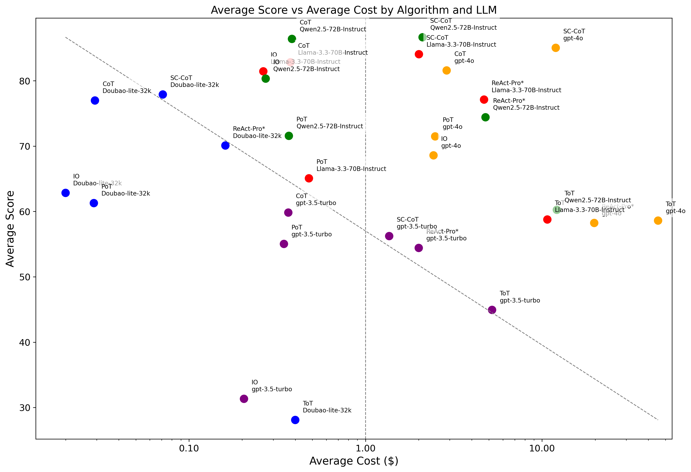

<div>
    <h1 align="center">🏅 Open Agent Leaderboard </h1>
</div>

<p align="center">
  <a href="https://huggingface.co/spaces/omlab/open-agent-leaderboard">🤗 HF Leaderboard
  </a>
</p>

## 🎉 Updates

- 2025/2/11: Add deepseek-r1:1.5b, a new dataset MATH-500, and a new algorithm ToT into the leaderboard.
- 2025/1/23: Add gpt-4o, Qwen2.5-72B-Instruct, Qwen2.5-7B-Instruct, Qwen2-1.5B-Instruct, Qwen2-0.5B-Instruct, Llama-3.3-70B-Instruct, Llama-3.1-8B-Instruct, Internllm2_5-7B into the leaderboard.
- 2025/1/07: The Open Agent Leaderboard is released.

## 📖 Introduction

This project aims to provide a fair comparison of various agents by evaluating their performance on different datasets and LLMs. Built on top of the [OmAgent](https://github.com/om-ai-lab/OmAgent) framework, it allows for simple, quick, and accurate assessments of agents.

Supported benchmark datasets:

- [gsm8k](https://huggingface.co/datasets/openai/gsm8k)
- [AQuA](https://github.com/google-deepmind/AQuA)
- [MATH-500](https://huggingface.co/datasets/HuggingFaceH4/MATH-500)

Supported algorithms:

- IO: Input-Output Direct Prompting (Baseline)
- [CoT: Chain-of-thought prompting elicits reasoning in large language models](https://arxiv.org/abs/2201.11903), [Large Language Models are Zero-Shot Reasoners](https://arxiv.org/pdf/2205.11916)
- [SC-CoT: Self-Consistency Improves Chain of Thought Reasoning in Language Models](https://arxiv.org/abs/2203.11171)
- [PoT: Program of thoughts prompting: Disentangling computation from reasoning for numerical reasoning tasks](https://arxiv.org/abs/2211.12588)
- [ReAct: ReAct: Synergizing Reasoning and Acting in Language Models](https://arxiv.org/abs/2210.03629)
- [ToT: Tree of Thoughts: Deliberate Problem Solving with Large Language Models](https://arxiv.org/abs/2305.10601)

Supported LLMs:

- gpt-3.5-turbo
- gpt-4o
- Doubao-lite-32k
- Qwen2.5-72B-Instruct
- Qwen2.5-7B-Instruct
- Qwen2-1.5B-Instruct
- Qwen2-0.5B-Instruct
- Llama-3.3-70B-Instruct
- Llama-3.1-8B-Instruct
- Internllm2_5-7B
- deepseek-r1:1.5b

## 🏅 Leaderboards

**Math tasks**

| **Rank** | **Algorithm** | **LLM**                | **Eval Date** | **Avg Score** | **gsm8k-Score** | **gsm8k-Cost($)** | **AQuA-Score** | **AQuA-Cost($)** | **MATH-500-Score** | **MATH-500-Cost($)** |
|:--------:|:-------------:|:----------------------:|:-------------:|:-------------:|:---------------:|:-----------------:|:--------------:|:----------------:|:------------------:|:--------------------:|
| **1**    | CoT           | Qwen2.5-72B-Instruct   | 2025/1/22     | 86.43         | 92.87           | 0.7195            | 86.22          | 0.0808           | 80.2               | 0.349                |
| **2**    | SC-CoT        | Qwen2.5-72B-Instruct   | 2025/1/22     | 84.3          | 93.86           | 5.9858            | 85.04          | 1.0348           | 74                 | 3.1556               |
| **3**    | SC-CoT        | Llama-3.3-70B-Instruct | 2025/1/22     | 83.85         | 95.07           | 6.2005            | 82.28          | 1.0756           | 74.2               | 3.2239               |
| **4**    | CoT           | Llama-3.3-70B-Instruct | 2025/1/22     | 82.86         | 93.93           | 0.687             | 83.46          | 0.0927           | 71.2               | 0.3463               |
| **5**    | CoT           | gpt-4o                 | 2025/1/22     | 81.59         | 94.09           | 4.5367            | 82.68          | 1.0417           | 68                 | 3.0569               |
| **6**    | IO            | Llama-3.3-70B-Instruct | 2025/1/22     | 81.45         | 92.27           | 0.4709            | 82.68          | 0.0798           | 69.4               | 0.2386               |
| **7**    | IO            | Qwen2.5-72B-Instruct   | 2025/1/22     | 80.34         | 86.58           | 0.4899            | 84.25          | 0.0742           | 70.2               | 0.2506               |
| **8**    | SC-CoT        | Qwen2.5-7B-Instruct    | 2025/1/22     | 79.35         | 91.13           | 0                 | 79.92          | 0                | 67                 | 0                    |
| **9**    | CoT           | Qwen2.5-7B-Instruct    | 2025/1/22     | 78.73         | 85.67           | 0                 | 80.71          | 0                | 69.8               | 0                    |
| **10**   | ReAct-Pro*    | Llama-3.3-70B-Instruct | 2025/1/22     | 77.12         | 87.64           | 10.1124           | 79.13          | 0.768            | 64.6               | 3.1806               |
| **11**   | CoT           | Doubao-lite-32k        | 2025/1/7      | 77            | 89.31           | 0.0558            | 82.68          | 0.0066           | 59                 | 0.0255               |
| **12**   | ReAct-Pro*    | Qwen2.5-72B-Instruct   | 2025/1/22     | 74.43         | 87.26           | 10.5479           | 73.23          | 0.3177           | 62.8               | 3.4541               |
| **13**   | SC-CoT        | Doubao-lite-32k        | 2025/1/7      | 72.52         | 87.26           | 0.2083            | 81.1           | 0.0519           | 49.2               | 0.1406               |
| **14**   | PoT           | Qwen2.5-72B-Instruct   | 2025/1/22     | 71.58         | 92.34           | 0.7054            | 75.2           | 0.1645           | 47.2               | 0.233                |
| **15**   | PoT           | gpt-4o                 | 2025/1/22     | 71.5          | 93.1            | 4.2166            | 75.2           | 1.6087           | 46.2               | 1.5994               |
| **16**   | SC-CoT        | gpt-4o                 | 2025/1/22     | 70.44         | 90.3            | 31.0542           | 86.61          | 8.1485           | 34.4               | 19.6538              |
| **17**   | ReAct-Pro*    | Doubao-lite-32k        | 2025/1/7      | 70.12         | 85.6            | 0.2512            | 77.56          | 0.0445           | 47.2               | 0.186                |
| **18**   | ReAct-Pro*    | Qwen2.5-7B-Instruct    | 2025/1/22     | 68.69         | 82.87           | 0                 | 74.41          | 0                | 48.8               | 0                    |
| **19**   | IO            | gpt-4o                 | 2025/1/22     | 68.6          | 88.4            | 3.3463            | 75.59          | 1.1453           | 41.8               | 2.7907               |
| **20**   | IO            | Qwen2.5-7B-Instruct    | 2025/1/22     | 65.13         | 57.24           | 0                 | 78.74          | 0                | 59.4               | 0                    |
| **21**   | PoT           | Llama-3.3-70B-Instruct | 2025/1/22     | 65.07         | 73.09           | 0.9736            | 79.53          | 0.1746           | 42.6               | 0.2839               |
| **22**   | CoT           | deepseek-r1:1.5b       | 2025/1/23     | 63.9          | 70.66           | 0                 | 71.65          | 0                | 49.4               | 0                    |
| **23**   | IO            | Doubao-lite-32k        | 2025/1/7      | 62.85         | 72.02           | 0.0354            | 79.13          | 0.0058           | 37.4               | 0.0187               |
| **24**   | PoT           | Doubao-lite-32k        | 2025/1/7      | 61.29         | 79.61           | 0.0576            | 71.65          | 0.0147           | 32.6               | 0.0144               |
| **25**   | ToT           | Qwen2.5-72B-Instruct   | 2025/1/22     | 60.26         | 88.88           | 23.5911           | 81.1           | 3.7389           | 10.8               | 9.0421               |
| **26**   | CoT           | gpt-3.5-turbo          | 2025/1/7      | 59.84         | 78.7            | 0.6788            | 61.02          | 0.0957           | 39.8               | 0.3189               |
| **27**   | CoT           | Internllm2_5-7B        | 2025/1/22     | 59.02         | 77.71           | 0                 | 52.76          | 0                | 46.6               | 0                    |
| **28**   | IO            | deepseek-r1:1.5b       | 2025/1/22     | 58.95         | 64.14           | 0                 | 68.9           | 0                | 43.8               | 0                    |
| **29**   | ToT           | Llama-3.3-70B-Instruct | 2025/1/22     | 58.79         | 91.89           | 20.8753           | 83.07          | 2.9404           | 1.4                | 8.2699               |
| **30**   | ToT           | gpt-4o                 | 2025/1/22     | 58.61         | 91.13           | 86.8581           | 81.5           | 8.5295           | 3.2                | 40.8094              |
| **31**   | SC-CoT        | gpt-3.5-turbo          | 2025/1/7      | 58.28         | 79.91           | 3.3938            | 66.14          | 0.7888           | 28.8               | 1.9764               |
| **32**   | ReAct-Pro*    | gpt-4o                 | 2025/1/22     | 58.26         | 63.31           | 39.0751           | 57.48          | 2.304            | 54                 | 17.7735              |
| **33**   | PoT           | Qwen2.5-7B-Instruct    | 2025/1/22     | 55.51         | 58.83           | 0                 | 68.11          | 0                | 39.6               | 0                    |
| **34**   | PoT           | gpt-3.5-turbo          | 2025/1/7      | 55.04         | 76.88           | 0.6902            | 59.45          | 0.1748           | 28.8               | 0.168                |
| **35**   | ReAct-Pro*    | gpt-3.5-turbo          | 2025/1/7      | 54.43         | 74.91           | 3.4633            | 64.57          | 0.4928           | 23.8               | 2.0406               |
| **36**   | SC-CoT        | Llama-3.1-8B-Instruct  | 2025/1/22     | 54.37         | 73.46           | 0                 | 59.45          | 0                | 30.2               | 0                    |
| **37**   | CoT           | Llama-3.1-8B-Instruct  | 2025/1/22     | 53.96         | 75.44           | 0                 | 60.63          | 0                | 25.8               | 0                    |
| **38**   | SC-CoT        | deepseek-r1:1.5b       | 2025/2/10     | 50.8          | 55.34           | 0                 | 59.06          | 0                | 38                 | 0                    |
| **39**   | ReAct-Pro*    | Llama-3.1-8B-Instruct  | 2025/1/22     | 50.7          | 67.78           | 0                 | 55.51          | 0                | 28.8               | 0                    |
| **40**   | IO            | Llama-3.1-8B-Instruct  | 2025/1/22     | 48.98         | 57.16           | 0                 | 51.18          | 0                | 38.6               | 0                    |
| **41**   | ToT           | gpt-3.5-turbo          | 2025/1/7      | 44.94         | 67.93           | 9.1707            | 57.09          | 1.1513           | 9.8                | 5.2914               |
| **42**   | ToT           | Qwen2.5-7B-Instruct    | 2025/1/22     | 42.52         | 72.21           | 0                 | 53.94          | 0                | 1.4                | 0                    |
| **43**   | ToT           | Llama-3.1-8B-Instruct  | 2025/1/22     | 41.97         | 65.05           | 0                 | 59.06          | 0                | 1.8                | 0                    |
| **44**   | ReAct-Pro*    | deepseek-r1:1.5b       | 2025/2/10     | 38.22         | 35.94           | 0                 | 54.33          | 0                | 24.4               | 0                    |
| **45**   | CoT           | Qwen2-1.5B-Instruct    | 2025/1/22     | 37.08         | 55.5            | 0                 | 40.55          | 0                | 15.2               | 0                    |
| **46**   | PoT           | Llama-3.1-8B-Instruct  | 2025/1/22     | 33.56         | 38.67           | 0                 | 36.61          | 0                | 25.4               | 0                    |
| **47**   | SC-CoT        | Internllm2_5-7B        | 2025/1/22     | 32.46         | 48.22           | 0                 | 39.37          | 0                | 9.8                | 0                    |
| **48**   | IO            | gpt-3.5-turbo          | 2025/1/7      | 31.34         | 37.83           | 0.3328            | 38.98          | 0.038            | 17.2               | 0.2436               |
| **49**   | PoT           | Internllm2_5-7B        | 2025/1/22     | 29.94         | 38.21           | 0                 | 36.61          | 0                | 15                 | 0                    |
| **50**   | ReAct-Pro*    | Internllm2_5-7B        | 2025/1/22     | 29.75         | 33.51           | 0                 | 40.94          | 0                | 14.8               | 0                    |
| **51**   | ToT           | Doubao-lite-32k        | 2025/1/7      | 28.1          | 37.83           | 0.8739            | 45.28          | 0.0881           | 1.2                | 0.2371               |
| **52**   | IO            | Internllm2_5-7B        | 2025/1/22     | 27.35         | 11.6            | 0                 | 47.64          | 0                | 22.8               | 0                    |
| **53**   | CoT           | Qwen2-0.5B-Instruct    | 2025/1/22     | 25.07         | 35.94           | 0                 | 33.07          | 0                | 6.2                | 0                    |
| **54**   | PoT           | deepseek-r1:1.5b       | 2025/2/10     | 22.54         | 11.9            | 0                 | 54.72          | 0                | 1                  | 0                    |
| **55**   | ReAct-Pro*    | Qwen2-1.5B-Instruct    | 2025/1/22     | 19.55         | 24.87           | 0                 | 25.59          | 0                | 8.2                | 0                    |
| **56**   | ToT           | Internllm2_5-7B        | 2025/1/22     | 18.96         | 20.85           | 0                 | 35.83          | 0                | 0.2                | 0                    |
| **57**   | IO            | Qwen2-1.5B-Instruct    | 2025/1/22     | 17.6          | 16.68           | 0                 | 29.13          | 0                | 7                  | 0                    |
| **58**   | ToT           | Qwen2-1.5B-Instruct    | 2025/1/22     | 17.31         | 19.64           | 0                 | 31.5           | 0                | 0.8                | 0                    |
| **59**   | PoT           | Qwen2-1.5B-Instruct    | 2025/1/22     | 16.67         | 18.5            | 0                 | 30.71          | 0                | 0.8                | 0                    |
| **60**   | ToT           | deepseek-r1:1.5b       | 2025/2/10     | 16.11         | 23.12           | 0                 | 24.8           | 0                | 0.4                | 0                    |
| **61**   | IO            | Qwen2-0.5B-Instruct    | 2025/1/22     | 14.83         | 14.71           | 0                 | 27.17          | 0                | 2.6                | 0                    |
| **62**   | SC-CoT        | Qwen2-1.5B-Instruct    | 2025/1/22     | 13.06         | 11.75           | 0                 | 23.62          | 0                | 3.8                | 0                    |
| **63**   | ReAct-Pro*    | Qwen2-0.5B-Instruct    | 2025/1/22     | 10.76         | 7.66            | 0                 | 24.02          | 0                | 0.6                | 0                    |
| **64**   | ToT           | Qwen2-0.5B-Instruct    | 2025/1/22     | 9.97          | 0               | 0                 | 29.92          | 0                | 0                  | 0                    |
| **65**   | PoT           | Qwen2-0.5B-Instruct    | 2025/1/22     | 8.98          | 9.63            | 0                 | 17.32          | 0                | 0                  | 0                    |
| **66**   | SC-CoT        | Qwen2-0.5B-Instruct    | 2025/1/22     | 8.43          | 1.67            | 0                 | 22.83          | 0                | 0.8                | 0                    |


Evaluation details can be found in the [Evaluation Details](#evaluation-details) section and [huggingface leaderboard](https://huggingface.co/spaces/omlab/open-agent-leaderboard).

- IO (Input-Output) is the baseline method that directly prompts the model with the question and expects an answer without any intermediate reasoning steps. It represents the most basic way of using language models and serves as a reference point for evaluating the effectiveness of other algorithms.

- ReAct-Pro\*: We modified ReAct to ReAct-Pro, following the [Reflexion](https://github.com/noahshinn/reflexion) repository. Comparasion with the original ReAct repo can be found in the [Compare to ReAct](#comparison-react-with-react-pro) section.



## 🛠️ How to Install

1. Clone the repository:

   ```bash
   git clone https://github.com/om-ai-lab/open-agent-leaderboard.git
   cd open-agent-leaderboard
   ```

2. Install dependencies:

   ```bash
   pip install -r requirements.txt
   ```

## 🏗️ How to Evaluate Agents

### Step 1. Implement your agent in the [`omagent`](https://github.com/om-ai-lab/OmAgent) repository

Navigate to the agent repository:

    git clone https://github.com/om-ai-lab/OmAgent.git
    cd OmAgent

Set up the environment:

    pip install -e omagent-core

Implement your agent in the [`omagent`](https://github.com/om-ai-lab/OmAgent) repository, check the `examples/cot` folder.

### Step 2. Inference in OmAgent Repository

Run the inference script (cot as an example):

    cd examples/cot
    python eval_demo.py --model_id your_model_id --dataset_name your_dataset_name --dataset_path your_dataset_path --output_path your_output_path --output_name your_output_name --cot_method your_cot_method

#### Output Format

The output results are saved in JSON format and include the following fields:

- `id`: The unique identifier of the sample.
- `question`: The input question provided to the model.
- `last_output`: The raw output generated by the model.
- `output_postprocess` (optional): The processed output after cleansing.
- `ground_truth` (optional): The correct answer for the sample.
- `prompt_tokens`: The number of tokens in the input prompt.
- `completion_tokens`: The number of tokens in the model's output.

Example of an output JSON file:

```json
{
  "dataset": "gsm8k",
  "model_id": "gpt-3.5-turbo",
  "alg": "COT",
  "model_result": [
    {
      "id": 1,
      "question": "Q: There are 15 trees in the grove. Grove workers will plant trees in the grove today.....",
      "last_output": "Janet's ducks lay 16 eggs per day. She eats 3 for breakfast and uses 4 to bake muffins,...",
      "output_postprocess": "Paris",
      "ground_truth": "Paris",
      "prompt_tokens": 10,
      "completion_tokens": 5
    }
  ]
}
```

### Step 3. Evaluate inference results

Run the main script to perform evaluations:

```bash
python main.py --dataset <dataset_name> --model <model_name> --method <method_name> --output_dir <output_directory>
```

#### Parameters

- `--random_seed`: Random seed, default is 1.
- `--dataset`: Dataset to use, options are `aqua`, `gsm8k`, `math500`.
- `--minibatch_size`: Minibatch size, default is 1.
- `--max_num_worker`: Maximum number of workers for the data loader, default is 4.
- `--model`: Model used for decoding, options are `gpt-4o-mini`, `gpt-4o`, `gpt-3.5-turbo`.
- `--method`: Method, options are `zero_shot`, `zero_shot_cot`, `few_shot`, `few_shot_cot`.
- `--cot_trigger_no`: Trigger sentence number for chain of thought, default is 1.
- `--max_length`: Maximum length of model output, default is 2048.
- `--max_length_direct`: Maximum length of direct model answer, default is 32.
- `--limit_dataset_size`: Whether to limit the test dataset size, default is 0 (no limit).
- `--output_dir`: Output directory, default is `./outputs/`.
- `--output_path`: Output path, default is empty.
- `--agent`: Agent used for the experiment, options are `cot`, `pot`, `sc_cot`, `react`.
- `--system_prompt`: System prompt, default is empty.
- `--openai_api_key`: OpenAI API key, default is empty.
- `--openai_url`: OpenAI API URL, default is `https://api.openai.com/v1`.

#### Example

```bash
python main.py --output_path example/gsm8k_results_cot.json --dataset gsm8k --method few_shot_cot
```

### Evaluation details


| **Algorithm**  | **Dataset** | **Eval Date** | **LLM**                | **Score** | **Pass rate** | **X-shot** | **Parameters**                                                                                                                | **Samples** | **Total input tokens** | **Average input tokens** | **Total output tokens** | **Average output tokens** | **All tokens** | **Cost($)** |
|:--------------:|:-----------:|:-------------:|:----------------------:|:---------:|:-------------:|:----------:|:-----------------------------------------------------------------------------------------------------------------------------:|:-----------:|:----------------------:|:------------------------:|:-----------------------:|:-------------------------:|:--------------:|:-----------:|
| **IO**         | gsm8k       | 2025/1/7      | gpt-3.5-turbo          | 37.83     | 99.92         | 8          |                                                                                                                               | 1,319       | 546,990                | 415                      | 39,563                  | 30                        | 586,553        | 0.3328      |
| **IO**         | gsm8k       | 2025/1/7      | Doubao-lite-32k        | 72.02     | 99.92         | 8          |                                                                                                                               | 1,319       | 617,377                | 468                      | 123,106                 | 93                        | 740,483        | 0.0354      |
| **IO**         | gsm8k       | 2025/1/22     | gpt-4o                 | 88.4      | 100           | 8          |                                                                                                                               | 1,319       | 542,416                | 411                      | 199,030                 | 151                       | 741,446        | 3.3463      |
| **IO**         | gsm8k       | 2025/1/22     | Qwen2.5-72B-Instruct   | 86.58     | 100           | 8          |                                                                                                                               | 1,319       | 555,340                | 421                      | 313,720                 | 238                       | 869,060        | 0.4899      |
| **IO**         | gsm8k       | 2025/1/22     | Llama-3.3-70B-Instruct | 92.27     | 100           | 8          |                                                                                                                               | 1,319       | 583,916                | 443                      | 251,359                 | 191                       | 835,275        | 0.4709      |
| **IO**         | gsm8k       | 2025/1/22     | Qwen2.5-7B-Instruct    | 57.24     | 100           | 8          |                                                                                                                               | 1,319       | 596,229                | 452                      | 291,684                 | 221                       | 887,913        | 0           |
| **IO**         | gsm8k       | 2025/1/22     | Llama-3.1-8B-Instruct  | 57.16     | 99.55         | 8          |                                                                                                                               | 1,319       | 550,941                | 418                      | 1,194,488               | 906                       | 1,745,429      | 0           |
| **IO**         | gsm8k       | 2025/1/22     | Internllm2_5-7B        | 11.6      | 97.95         | 8          |                                                                                                                               | 1,319       | 679,302                | 515                      | 434,426                 | 329                       | 1,113,728      | 0           |
| **IO**         | gsm8k       | 2025/1/22     | Qwen2-1.5B-Instruct    | 16.68     | 100           | 8          |                                                                                                                               | 1,319       | 568,530                | 431                      | 168,466                 | 128                       | 736,996        | 0           |
| **IO**         | gsm8k       | 2025/1/22     | Qwen2-0.5B-Instruct    | 14.71     | 100           | 8          |                                                                                                                               | 1,319       | 568,116                | 431                      | 266,781                 | 202                       | 834,897        | 0           |
| **IO**         | gsm8k       | 2025/1/22     | deepseek-r1:1.5b       | 64.14     | 99.62         | 8          |                                                                                                                               | 1,319       | 561,935                | 426                      | 921,116                 | 698                       | 1,483,051      | 0           |
| **ReAct-Pro*** | gsm8k       | 2025/1/7      | gpt-3.5-turbo          | 74.91     | 99.39         | 8          | max_steps=10                                                                                                                  | 1,319       | 6,506,164              | 4,933                    | 140,122                 | 106                       | 6,646,286      | 3.4633      |
| **ReAct-Pro*** | gsm8k       | 2025/1/7      | Doubao-lite-32k        | 85.6      | 99.62         | 8          | max_steps=10                                                                                                                  | 1,319       | 5,862,016              | 4,444                    | 136,623                 | 104                       | 5,998,639      | 0.2512      |
| **ReAct-Pro*** | gsm8k       | 2025/1/22     | gpt-4o                 | 63.31     | 99.55         | 8          | max_steps=10                                                                                                                  | 1,319       | 14,411,173             | 10,926                   | 304,714                 | 231                       | 14,715,887     | 39.0751     |
| **ReAct-Pro*** | gsm8k       | 2025/1/22     | Qwen2.5-72B-Instruct   | 87.26     | 100           | 8          | max_steps=10                                                                                                                  | 1,319       | 18,160,983             | 13,769                   | 549,454                 | 417                       | 18,710,437     | 10.5479     |
| **ReAct-Pro*** | gsm8k       | 2025/1/22     | Llama-3.3-70B-Instruct | 87.64     | 99.92         | 8          | max_steps=10                                                                                                                  | 1,319       | 17,038,928             | 12,918                   | 898,936                 | 682                       | 17,937,864     | 10.1124     |
| **ReAct-Pro*** | gsm8k       | 2025/1/22     | Qwen2.5-7B-Instruct    | 82.87     | 100           | 8          | max_steps=10                                                                                                                  | 1,319       | 14,355,752             | 10,884                   | 495,162                 | 375                       | 14,850,914     | 0           |
| **ReAct-Pro*** | gsm8k       | 2025/1/22     | Llama-3.1-8B-Instruct  | 67.78     | 98.56         | 8          | max_steps=10                                                                                                                  | 1,319       | 21,044,978             | 15,955                   | 1,790,789               | 1,358                     | 22,835,767     | 0           |
| **ReAct-Pro*** | gsm8k       | 2025/1/22     | Internllm2_5-7B        | 33.51     | 97.95         | 8          | max_steps=10                                                                                                                  | 1,319       | 30,120,070             | 22,836                   | 5,549,919               | 4,208                     | 35,669,989     | 0           |
| **ReAct-Pro*** | gsm8k       | 2025/1/22     | Qwen2-1.5B-Instruct    | 24.87     | 80.21         | 8          | max_steps=10                                                                                                                  | 1,319       | 9,133,603              | 6,925                    | 694,398                 | 526                       | 9,828,001      | 0           |
| **ReAct-Pro*** | gsm8k       | 2025/1/22     | Qwen2-0.5B-Instruct    | 7.66      | 95.22         | 8          | max_steps=10                                                                                                                  | 1,319       | 52,431,343             | 39,751                   | 2,961,268               | 2,245                     | 55,392,611     | 0           |
| **ReAct-Pro*** | gsm8k       | 2025/2/10     | deepseek-r1:1.5b       | 35.94     | 99.62         | 8          | max_steps=10                                                                                                                  | 1,319       | 19,299,381             | 14,632                   | 4,919,696               | 3,730                     | 24,219,077     | 0           |
| **PoT**        | gsm8k       | 2025/1/7      | gpt-3.5-turbo          | 76.88     | 99.24         | 8          |                                                                                                                               | 1,319       | 1,090,418              | 827                      | 96,662                  | 73                        | 1,187,080      | 0.6902      |
| **PoT**        | gsm8k       | 2025/1/7      | Doubao-lite-32k        | 79.61     | 92.57         | 8          |                                                                                                                               | 1,319       | 1,170,038              | 887                      | 118,017                 | 89                        | 1,288,055      | 0.0576      |
| **PoT**        | gsm8k       | 2025/1/22     | gpt-4o                 | 93.1      | 99.77         | 8          |                                                                                                                               | 1,319       | 1,101,672              | 835                      | 146,240                 | 111                       | 1,247,912      | 4.2166      |
| **PoT**        | gsm8k       | 2025/1/22     | Qwen2.5-72B-Instruct   | 92.34     | 99.39         | 8          |                                                                                                                               | 1,319       | 1,106,682              | 839                      | 144,528                 | 110                       | 1,251,210      | 0.7054      |
| **PoT**        | gsm8k       | 2025/1/22     | Llama-3.3-70B-Instruct | 73.09     | 79.61         | 8          |                                                                                                                               | 1,319       | 1,126,025              | 854                      | 601,019                 | 456                       | 1,727,044      | 0.9736      |
| **PoT**        | gsm8k       | 2025/1/22     | Qwen2.5-7B-Instruct    | 58.83     | 70.51         | 8          |                                                                                                                               | 1,319       | 1,145,390              | 868                      | 217,432                 | 165                       | 1,362,822      | 0           |
| **PoT**        | gsm8k       | 2025/1/22     | Llama-3.1-8B-Instruct  | 38.67     | 55.42         | 8          |                                                                                                                               | 1,319       | 1,147,538              | 870                      | 243,573                 | 185                       | 1,391,111      | 0           |
| **PoT**        | gsm8k       | 2025/1/22     | Internllm2_5-7B        | 38.21     | 48.9          | 8          |                                                                                                                               | 1,319       | 1,136,843              | 862                      | 188,106                 | 143                       | 1,324,949      | 0           |
| **PoT**        | gsm8k       | 2025/1/22     | Qwen2-1.5B-Instruct    | 18.5      | 31.01         | 8          |                                                                                                                               | 1,319       | 1,151,528              | 873                      | 175,994                 | 133                       | 1,327,522      | 0           |
| **PoT**        | gsm8k       | 2025/1/22     | Qwen2-0.5B-Instruct    | 9.63      | 16.91         | 8          |                                                                                                                               | 1,319       | 1,151,528              | 873                      | 237,607                 | 180                       | 1,389,135      | 0           |
| **PoT**        | gsm8k       | 2025/2/10     | deepseek-r1:1.5b       | 11.9      | 17.44         | 8          |                                                                                                                               | 1,319       | 1,138,872              | 863                      | 815,637                 | 618                       | 1,954,509      | 0           |
| **CoT**        | gsm8k       | 2025/1/7      | gpt-3.5-turbo          | 78.7      | 100           | 8          |                                                                                                                               | 1,319       | 953,242                | 723                      | 134,799                 | 102                       | 1,088,041      | 0.6788      |
| **CoT**        | gsm8k       | 2025/1/7      | Doubao-lite-32k        | 89.31     | 100           | 8          |                                                                                                                               | 1,319       | 1,042,095              | 790                      | 159,725                 | 121                       | 1,201,820      | 0.0558      |
| **CoT**        | gsm8k       | 2025/1/22     | gpt-4o                 | 94.09     | 100           | 8          |                                                                                                                               | 1,319       | 948,668                | 719                      | 216,498                 | 164                       | 1,165,166      | 4.5367      |
| **CoT**        | gsm8k       | 2025/1/22     | Qwen2.5-72B-Instruct   | 92.87     | 100           | 8          |                                                                                                                               | 1,319       | 1,005,119              | 762                      | 271,133                 | 206                       | 1,276,252      | 0.7195      |
| **CoT**        | gsm8k       | 2025/1/22     | Llama-3.3-70B-Instruct | 93.93     | 100           | 8          |                                                                                                                               | 1,319       | 990,168                | 751                      | 228,497                 | 173                       | 1,218,665      | 0.687       |
| **CoT**        | gsm8k       | 2025/1/22     | Qwen2.5-7B-Instruct    | 85.67     | 100           | 8          |                                                                                                                               | 1,319       | 1,046,008              | 793                      | 244,797                 | 186                       | 1,290,805      | 0           |
| **CoT**        | gsm8k       | 2025/1/22     | Llama-3.1-8B-Instruct  | 75.44     | 99.92         | 8          |                                                                                                                               | 1,319       | 990,168                | 751                      | 258,161                 | 196                       | 1,248,329      | 0           |
| **CoT**        | gsm8k       | 2025/1/22     | Internllm2_5-7B        | 77.71     | 99.7          | 8          |                                                                                                                               | 1,319       | 968,163                | 734                      | 234,000                 | 177                       | 1,202,163      | 0           |
| **CoT**        | gsm8k       | 2025/1/22     | Qwen2-1.5B-Instruct    | 55.5      | 100           | 8          |                                                                                                                               | 1,319       | 1,032,818              | 783                      | 185,707                 | 141                       | 1,218,525      | 0           |
| **CoT**        | gsm8k       | 2025/1/22     | Qwen2-0.5B-Instruct    | 35.94     | 99.92         | 8          |                                                                                                                               | 1,319       | 1,032,818              | 783                      | 190,641                 | 145                       | 1,223,459      | 0           |
| **CoT**        | gsm8k       | 2025/1/23     | deepseek-r1:1.5b       | 70.66     | 99.77         | 8          |                                                                                                                               | 1,319       | 1,011,714              | 767                      | 1,078,911               | 818                       | 2,090,625      | 0           |
| **SC-CoT**     | gsm8k       | 2025/1/7      | gpt-3.5-turbo          | 79.91     | 99.92         | 8          | temperature=1, path_num=5                                                                                                     | 1,319       | 2,740,652              | 2,078                    | 1,348,960               | 1,023                     | 4,089,612      | 3.3938      |
| **SC-CoT**     | gsm8k       | 2025/1/7      | Doubao-lite-32k        | 87.26     | 99.92         | 8          | temperature=1, path_num=5                                                                                                     | 1,319       | 2,691,714              | 2,041                    | 1,197,099               | 908                       | 3,888,813      | 0.2083      |
| **SC-CoT**     | gsm8k       | 2025/1/22     | gpt-4o                 | 90.3      | 99.92         | 8          | temperature=1, path_num=5                                                                                                     | 1,319       | 3,590,336              | 2,722                    | 2,207,837               | 1,674                     | 5,798,173      | 31.0542     |
| **SC-CoT**     | gsm8k       | 2025/1/22     | Qwen2.5-72B-Instruct   | 93.86     | 100           | 8          | temperature=1, path_num=5                                                                                                     | 1,319       | 8,136,223              | 6,168                    | 2,481,785               | 1,882                     | 10,618,008     | 5.9858      |
| **SC-CoT**     | gsm8k       | 2025/1/22     | Llama-3.3-70B-Instruct | 95.07     | 100           | 8          | temperature=1, path_num=5                                                                                                     | 1,319       | 8,413,717              | 6,379                    | 2,585,077               | 1,960                     | 10,998,794     | 6.2005      |
| **SC-CoT**     | gsm8k       | 2025/1/22     | Qwen2.5-7B-Instruct    | 91.13     | 100           | 8          | temperature=1, path_num=5                                                                                                     | 1,319       | 8,586,888              | 6,510                    | 2,554,097               | 1,936                     | 11,140,985     | 0           |
| **SC-CoT**     | gsm8k       | 2025/1/22     | Llama-3.1-8B-Instruct  | 73.46     | 99.55         | 8          | temperature=1, path_num=5                                                                                                     | 1,319       | 8,630,514              | 6,543                    | 3,148,202               | 2,387                     | 11,778,716     | 0           |
| **SC-CoT**     | gsm8k       | 2025/1/22     | Internllm2_5-7B        | 48.22     | 98.41         | 8          | temperature=1, path_num=5                                                                                                     | 1,319       | 10,678,792             | 8,096                    | 3,847,639               | 2,917                     | 14,526,431     | 0           |
| **SC-CoT**     | gsm8k       | 2025/1/22     | Qwen2-1.5B-Instruct    | 11.75     | 91.89         | 8          | temperature=1, path_num=5                                                                                                     | 1,319       | 9,066,115              | 6,873                    | 3,345,827               | 2,537                     | 12,411,942     | 0           |
| **SC-CoT**     | gsm8k       | 2025/1/22     | Qwen2-0.5B-Instruct    | 1.67      | 94.69         | 8          | temperature=1, path_num=5                                                                                                     | 1,319       | 11,019,864             | 8,355                    | 5,445,856               | 4,129                     | 16,465,720     | 0           |
| **SC-CoT**     | gsm8k       | 2025/2/10     | deepseek-r1:1.5b       | 55.34     | 99.7          | 8          | temperature=1, path_num=5                                                                                                     | 1,319       | 14,540,096             | 11,024                   | 11,245,769              | 8,526                     | 25,785,865     | 0           |
| **ToT**        | gsm8k       | 2025/1/7      | gpt-3.5-turbo          | 67.93     | 99.7          | 8          | search_type=bfs, b=1, max_depth=6, max_steps=6, generation_n=1, evaluation_n=3, evaluation_type=vote, use_llm_completion=true | 1,319       | 15,920,037             | 12,070                   | 807,138                 | 612                       | 16,727,175     | 9.1707      |
| **ToT**        | gsm8k       | 2025/1/7      | Doubao-lite-32k        | 37.83     | 87.34         | 8          | search_type=bfs, b=1, max_depth=6, max_steps=6, generation_n=1, evaluation_n=3, evaluation_type=vote, use_llm_completion=true | 1,319       | 19,208,597             | 14,563                   | 1,065,752               | 808                       | 20,274,349     | 0.8739      |
| **ToT**        | gsm8k       | 2025/1/22     | gpt-4o                 | 91.13     | 100           | 8          | search_type=bfs, b=1, max_depth=6, max_steps=6, generation_n=1, evaluation_n=3, evaluation_type=vote, use_llm_completion=true | 1,319       | 29,445,237             | 22,324                   | 1,324,498               | 1,004                     | 30,769,735     | 86.8581     |
| **ToT**        | gsm8k       | 2025/1/22     | Qwen2.5-72B-Instruct   | 88.88     | 100           | 8          | search_type=bfs, b=1, max_depth=6, max_steps=6, generation_n=1, evaluation_n=3, evaluation_type=vote, use_llm_completion=true | 1,319       | 40,435,361             | 30,656                   | 1,411,787               | 1,070                     | 41,847,148     | 23.5911     |
| **ToT**        | gsm8k       | 2025/1/22     | Llama-3.3-70B-Instruct | 91.89     | 100           | 8          | search_type=bfs, b=1, max_depth=6, max_steps=6, generation_n=1, evaluation_n=3, evaluation_type=vote, use_llm_completion=true | 1,319       | 35,096,810             | 26,609                   | 1,932,877               | 1,465                     | 37,029,687     | 20.8753     |
| **ToT**        | gsm8k       | 2025/1/22     | Qwen2.5-7B-Instruct    | 72.21     | 99.01         | 8          | search_type=bfs, b=1, max_depth=6, max_steps=6, generation_n=1, evaluation_n=3, evaluation_type=vote, use_llm_completion=true | 1,319       | 20,196,528             | 15,312                   | 11,460,791              | 8,689                     | 31,657,319     | 0           |
| **ToT**        | gsm8k       | 2025/1/22     | Llama-3.1-8B-Instruct  | 65.05     | 91.96         | 8          | search_type=bfs, b=1, max_depth=6, max_steps=6, generation_n=1, evaluation_n=3, evaluation_type=vote, use_llm_completion=true | 1,319       | 15,554,967             | 11,793                   | 877,135                 | 665                       | 16,432,102     | 0           |
| **ToT**        | gsm8k       | 2025/1/22     | Internllm2_5-7B        | 20.85     | 70.13         | 8          | search_type=bfs, b=1, max_depth=6, max_steps=6, generation_n=1, evaluation_n=3, evaluation_type=vote, use_llm_completion=true | 1,319       | 11,768,118             | 8,922                    | 1,410,011               | 1,069                     | 13,178,129     | 0           |
| **ToT**        | gsm8k       | 2025/1/22     | Qwen2-1.5B-Instruct    | 19.64     | 77.26         | 8          | search_type=bfs, b=1, max_depth=6, max_steps=6, generation_n=1, evaluation_n=3, evaluation_type=vote, use_llm_completion=true | 1,319       | 12,124,248             | 9,192                    | 634,439                 | 481                       | 12,758,687     | 0           |
| **ToT**        | gsm8k       | 2025/1/22     | Qwen2-0.5B-Instruct    | -         | -             | 8          | search_type=bfs, b=1, max_depth=6, max_steps=6, generation_n=1, evaluation_n=3, evaluation_type=vote, use_llm_completion=true | 1,319       | -                      | -                        | -                       | -                         | -              | -           |
| **ToT**        | gsm8k       | 2025/2/10     | deepseek-r1:1.5b       | 23.12     | 72.48         | 8          | search_type=bfs, b=1, max_depth=6, max_steps=6, generation_n=1, evaluation_n=3, evaluation_type=vote, use_llm_completion=true | 1,319       | 2,738,244              | 2,076                    | 683,242                 | 518                       | 3,421,486      | 0           |
| **IO**         | AQuA        | 2025/1/7      | gpt-3.5-turbo          | 38.98     | 100           | 0          |                                                                                                                               | 254         | 25,701                 | 101                      | 16,770                  | 66                        | 42,471         | 0.038       |
| **IO**         | AQuA        | 2025/1/7      | Doubao-lite-32k        | 79.13     | 100           | 0          |                                                                                                                               | 254         | 33,058                 | 130                      | 54,684                  | 215                       | 87,742         | 0.0058      |
| **IO**         | AQuA        | 2025/1/22     | gpt-4o                 | 75.59     | 97.24         | 0          |                                                                                                                               | 254         | 25,631                 | 101                      | 108,121                 | 426                       | 133,752        | 1.1453      |
| **IO**         | AQuA        | 2025/1/22     | Qwen2.5-72B-Instruct   | 84.25     | 99.61         | 0          |                                                                                                                               | 254         | 25,397                 | 100                      | 106,207                 | 418                       | 131,604        | 0.0742      |
| **IO**         | AQuA        | 2025/1/22     | Llama-3.3-70B-Instruct | 82.68     | 99.21         | 0          |                                                                                                                               | 254         | 32,809                 | 129                      | 108,758                 | 428                       | 141,567        | 0.0798      |
| **IO**         | AQuA        | 2025/1/22     | Qwen2.5-7B-Instruct    | 78.74     | 98.43         | 0          |                                                                                                                               | 254         | 33,271                 | 131                      | 104,500                 | 411                       | 137,771        | 0           |
| **IO**         | AQuA        | 2025/1/22     | Llama-3.1-8B-Instruct  | 51.18     | 98.82         | 0          |                                                                                                                               | 254         | 26,459                 | 104                      | 106,647                 | 420                       | 133,106        | 0           |
| **IO**         | AQuA        | 2025/1/22     | Internllm2_5-7B        | 47.64     | 90.94         | 0          |                                                                                                                               | 254         | 50,232                 | 198                      | 134,809                 | 531                       | 185,041        | 0           |
| **IO**         | AQuA        | 2025/1/22     | Qwen2-1.5B-Instruct    | 29.13     | 97.64         | 0          |                                                                                                                               | 254         | 27,937                 | 110                      | 43,110                  | 170                       | 71,047         | 0           |
| **IO**         | AQuA        | 2025/1/22     | Qwen2-0.5B-Instruct    | 27.17     | 98.82         | 0          |                                                                                                                               | 254         | 27,937                 | 110                      | 82,478                  | 325                       | 110,415        | 0           |
| **IO**         | AQuA        | 2025/1/22     | deepseek-r1:1.5b       | 68.9      | 94.88         | 0          |                                                                                                                               | 254         | 26,667                 | 105                      | 325,100                 | 1,280                     | 351,767        | 0           |
| **CoT**        | AQuA        | 2025/1/7      | gpt-3.5-turbo          | 61.02     | 93.7          | 0          |                                                                                                                               | 254         | 25,447                 | 100                      | 55,346                  | 218                       | 80,793         | 0.0957      |
| **CoT**        | AQuA        | 2025/1/7      | Doubao-lite-32k        | 82.68     | 97.24         | 0          |                                                                                                                               | 254         | 27,978                 | 110                      | 66,599                  | 262                       | 94,577         | 0.0066      |
| **CoT**        | AQuA        | 2025/1/22     | gpt-4o                 | 82.68     | 98.03         | 0          |                                                                                                                               | 254         | 25,123                 | 99                       | 97,894                  | 385                       | 123,017        | 1.0417      |
| **CoT**        | AQuA        | 2025/1/22     | Qwen2.5-72B-Instruct   | 86.22     | 99.21         | 0          |                                                                                                                               | 254         | 25,143                 | 99                       | 118,146                 | 465                       | 143,289        | 0.0808      |
| **CoT**        | AQuA        | 2025/1/22     | Llama-3.3-70B-Instruct | 83.46     | 98.43         | 0          |                                                                                                                               | 254         | 32,555                 | 128                      | 131,834                 | 519                       | 164,389        | 0.0927      |
| **CoT**        | AQuA        | 2025/1/22     | Qwen2.5-7B-Instruct    | 80.71     | 99.61         | 0          |                                                                                                                               | 254         | 33,017                 | 130                      | 116,719                 | 460                       | 149,736        | 0           |
| **CoT**        | AQuA        | 2025/1/22     | Llama-3.1-8B-Instruct  | 60.63     | 100           | 0          |                                                                                                                               | 254         | 32,555                 | 128                      | 111,880                 | 440                       | 144,435        | 0           |
| **CoT**        | AQuA        | 2025/1/22     | Internllm2_5-7B        | 52.76     | 89.37         | 0          |                                                                                                                               | 254         | 26,610                 | 105                      | 100,910                 | 397                       | 127,520        | 0           |
| **CoT**        | AQuA        | 2025/1/22     | Qwen2-1.5B-Instruct    | 40.55     | 98.82         | 0          |                                                                                                                               | 254         | 30,477                 | 120                      | 79,563                  | 313                       | 110,040        | 0           |
| **CoT**        | AQuA        | 2025/1/22     | Qwen2-0.5B-Instruct    | 33.07     | 98.82         | 0          |                                                                                                                               | 254         | 30,477                 | 120                      | 86,862                  | 342                       | 117,339        | 0           |
| **CoT**        | AQuA        | 2025/1/23     | deepseek-r1:1.5b       | 71.65     | 96.85         | 0          |                                                                                                                               | 254         | 26,413                 | 104                      | 306,659                 | 1,207                     | 333,072        | 0           |
| **PoT**        | AQuA        | 2025/1/7      | gpt-3.5-turbo          | 59.45     | 100           | 0          |                                                                                                                               | 254         | 225,162                | 886                      | 41,492                  | 163                       | 266,654        | 0.1748      |
| **PoT**        | AQuA        | 2025/1/7      | Doubao-lite-32k        | 71.65     | 96.85         | 0          |                                                                                                                               | 254         | 259,863                | 1,023                    | 49,573                  | 195                       | 309,436        | 0.0147      |
| **PoT**        | AQuA        | 2025/1/22     | gpt-4o                 | 75.2      | 100           | 0          |                                                                                                                               | 254         | 222,717                | 877                      | 105,191                 | 414                       | 327,908        | 1.6087      |
| **PoT**        | AQuA        | 2025/1/22     | Qwen2.5-72B-Instruct   | 75.2      | 100           | 0          |                                                                                                                               | 254         | 249,215                | 981                      | 42,549                  | 168                       | 291,764        | 0.1645      |
| **PoT**        | AQuA        | 2025/1/22     | Llama-3.3-70B-Instruct | 79.53     | 99.21         | 0          |                                                                                                                               | 254         | 240,735                | 948                      | 69,064                  | 272                       | 309,799        | 0.1746      |
| **PoT**        | AQuA        | 2025/1/22     | Qwen2.5-7B-Instruct    | 68.11     | 100           | 0          |                                                                                                                               | 254         | 264,517                | 1,041                    | 49,211                  | 194                       | 313,728        | 0           |
| **PoT**        | AQuA        | 2025/1/22     | Llama-3.1-8B-Instruct  | 36.61     | 96.85         | 0          |                                                                                                                               | 254         | 240,613                | 947                      | 50,301                  | 198                       | 290,914        | 0           |
| **PoT**        | AQuA        | 2025/1/22     | Internllm2_5-7B        | 36.61     | 98.82         | 0          |                                                                                                                               | 254         | 233,505                | 919                      | 68,457                  | 270                       | 301,962        | 0           |
| **PoT**        | AQuA        | 2025/1/22     | Qwen2-1.5B-Instruct    | 30.71     | 96.46         | 0          |                                                                                                                               | 254         | 246,560                | 971                      | 51,915                  | 204                       | 298,475        | 0           |
| **PoT**        | AQuA        | 2025/1/22     | Qwen2-0.5B-Instruct    | 17.32     | 92.13         | 0          |                                                                                                                               | 254         | 258,867                | 1,019                    | 63,414                  | 250                       | 322,281        | 0           |
| **PoT**        | AQuA        | 2025/2/10     | deepseek-r1:1.5b       | 54.72     | 97.24         | 0          |                                                                                                                               | 254         | 250,690                | 987                      | 765,957                 | 3,016                     | 1,016,647      | 0           |
| **SC-CoT**     | AQuA        | 2025/1/22     | gpt-3.5-turbo          | 66.14     | 99.21         | 0          | temperature=1, path_num=5                                                                                                     | 254         | 482,192                | 1,898                    | 365,143                 | 1,438                     | 847,335        | 0.7888      |
| **SC-CoT**     | AQuA        | 2025/1/22     | Doubao-lite-32k        | 81.1      | 97.24         | 0          | temperature=1, path_num=5                                                                                                     | 254         | 503,751                | 1,983                    | 382,235                 | 1,505                     | 885,986        | 0.0519      |
| **SC-CoT**     | AQuA        | 2025/1/22     | gpt-4o                 | 86.61     | 98.82         | 0          | temperature=1, path_num=5                                                                                                     | 254         | 744,478                | 2,931                    | 628,728                 | 2,475                     | 1,373,206      | 8.1485      |
| **SC-CoT**     | AQuA        | 2025/1/22     | Qwen2.5-72B-Instruct   | 85.04     | 99.21         | 0          | temperature=1, path_num=5                                                                                                     | 254         | 1,051,218              | 4,139                    | 784,451                 | 3,088                     | 1,835,669      | 1.0348      |
| **SC-CoT**     | AQuA        | 2025/1/22     | Llama-3.3-70B-Instruct | 82.28     | 99.21         | 0          | temperature=1, path_num=5                                                                                                     | 254         | 1,135,251              | 4,469                    | 772,673                 | 3,042                     | 1,907,924      | 1.0756      |
| **SC-CoT**     | AQuA        | 2025/1/22     | Qwen2.5-7B-Instruct    | 79.92     | 100           | 0          | temperature=1, path_num=5                                                                                                     | 254         | 1,098,280              | 4,324                    | 747,052                 | 2,941                     | 1,845,332      | 0           |
| **SC-CoT**     | AQuA        | 2025/1/22     | Llama-3.1-8B-Instruct  | 59.45     | 97.24         | 0          | temperature=1, path_num=5                                                                                                     | 254         | 971,003                | 3,823                    | 680,330                 | 2,678                     | 1,651,333      | 0           |
| **SC-CoT**     | AQuA        | 2025/1/22     | Internllm2_5-7B        | 39.37     | 98.03         | 0          | temperature=1, path_num=5                                                                                                     | 254         | 1,420,494              | 5,592                    | 875,728                 | 3,448                     | 2,296,222      | 0           |
| **SC-CoT**     | AQuA        | 2025/1/22     | Qwen2-1.5B-Instruct    | 23.62     | 96.46         | 0          | temperature=1, path_num=5                                                                                                     | 254         | 1,034,362              | 4,072                    | 740,973                 | 2,917                     | 1,775,335      | 0           |
| **SC-CoT**     | AQuA        | 2025/1/22     | Qwen2-0.5B-Instruct    | 22.83     | 97.24         | 0          | temperature=1, path_num=5                                                                                                     | 254         | 1,246,929              | 4,909                    | 968,162                 | 3,812                     | 2,215,091      | 0           |
| **SC-CoT**     | AQuA        | 2025/2/10     | deepseek-r1:1.5b       | 59.06     | 96.85         | 0          | temperature=1, path_num=5                                                                                                     | 254         | 2,547,772              | 10,031                   | 3,254,939               | 12,815                    | 5,802,711      | 0           |
| **ReAct-Pro*** | AQuA        | 2025/1/7      | gpt-3.5-turbo          | 64.57     | 98.03         | 0          | max_steps=10                                                                                                                  | 254         | 862,614                | 3,396                    | 40,973                  | 161                       | 903,587        | 0.4928      |
| **ReAct-Pro*** | AQuA        | 2025/1/7      | Doubao-lite-32k        | 77.56     | 96.06         | 0          | max_steps=10                                                                                                                  | 254         | 977,890                | 3,850                    | 54,951                  | 216                       | 1,032,841      | 0.0445      |
| **ReAct-Pro*** | AQuA        | 2025/1/22     | gpt-4o                 | 57.48     | 97.24         | 0          | max_steps=10                                                                                                                  | 254         | 615,589                | 2,424                    | 76,507                  | 301                       | 692,096        | 2.304       |
| **ReAct-Pro*** | AQuA        | 2025/1/22     | Qwen2.5-72B-Instruct   | 73.23     | 100           | 0          | max_steps=10                                                                                                                  | 254         | 441,765                | 1,739                    | 121,838                 | 480                       | 563,603        | 0.3177      |
| **ReAct-Pro*** | AQuA        | 2025/1/22     | Llama-3.3-70B-Instruct | 79.13     | 99.61         | 0          | max_steps=10                                                                                                                  | 254         | 1,119,143              | 4,406                    | 243,236                 | 958                       | 1,362,379      | 0.768       |
| **ReAct-Pro*** | AQuA        | 2025/1/22     | Qwen2.5-7B-Instruct    | 74.41     | 99.21         | 0          | max_steps=10                                                                                                                  | 254         | 564,165                | 2,221                    | 131,679                 | 518                       | 695,844        | 0           |
| **ReAct-Pro*** | AQuA        | 2025/1/22     | Llama-3.1-8B-Instruct  | 55.51     | 96.85         | 0          | max_steps=10                                                                                                                  | 254         | 3,764,723              | 14,822                   | 576,098                 | 2,268                     | 4,340,821      | 0           |
| **ReAct-Pro*** | AQuA        | 2025/1/22     | Internllm2_5-7B        | 40.94     | 96.85         | 0          | max_steps=10                                                                                                                  | 254         | 3,592,039              | 14,142                   | 836,762                 | 3,294                     | 4,428,801      | 0           |
| **ReAct-Pro*** | AQuA        | 2025/1/22     | Qwen2-1.5B-Instruct    | 25.59     | 96.06         | 0          | max_steps=10                                                                                                                  | 254         | 4,555,858              | 17,936                   | 516,146                 | 2,032                     | 5,072,004      | 0           |
| **ReAct-Pro*** | AQuA        | 2025/1/22     | Qwen2-0.5B-Instruct    | 24.02     | 96.85         | 0          | max_steps=10                                                                                                                  | 254         | 6,344,167              | 24,977                   | 825,920                 | 3,252                     | 7,170,087      | 0           |
| **ReAct-Pro*** | AQuA        | 2025/2/10     | deepseek-r1:1.5b       | 54.33     | 96.46         | 0          | max_steps=10                                                                                                                  | 254         | 10,578,715             | 41,648                   | 3,866,326               | 15,222                    | 14,445,041     | 0           |
| **ToT**        | AQuA        | 2025/1/7      | gpt-3.5-turbo          | 57.09     | 99.61         | 0          | search_type=bfs, b=1, max_depth=6, max_steps=6, generation_n=1, evaluation_n=3, evaluation_type=vote, use_llm_completion=true | 254         | 1,850,767              | 7,286                    | 150,629                 | 593                       | 2,001,396      | 1.1513      |
| **ToT**        | AQuA        | 2025/1/7      | Doubao-lite-32k        | 45.28     | 74.02         | 0          | search_type=bfs, b=1, max_depth=6, max_steps=6, generation_n=1, evaluation_n=3, evaluation_type=vote, use_llm_completion=true | 254         | 1,850,249              | 7,284                    | 150,301                 | 592                       | 2,000,550      | 0.0881      |
| **ToT**        | AQuA        | 2025/1/22     | gpt-4o                 | 81.5      | 99.21         | 0          | search_type=bfs, b=1, max_depth=6, max_steps=6, generation_n=1, evaluation_n=3, evaluation_type=vote, use_llm_completion=true | 254         | 2,347,538              | 9,242                    | 266,069                 | 1,048                     | 2,613,607      | 8.5295      |
| **ToT**        | AQuA        | 2025/1/22     | Qwen2.5-72B-Instruct   | 81.1      | 99.21         | 0          | search_type=bfs, b=1, max_depth=6, max_steps=6, generation_n=1, evaluation_n=3, evaluation_type=vote, use_llm_completion=true | 254         | 6,371,642              | 25,085                   | 260,613                 | 1,026                     | 6,632,255      | 3.7389      |
| **ToT**        | AQuA        | 2025/1/22     | Llama-3.3-70B-Instruct | 83.07     | 100           | 0          | search_type=bfs, b=1, max_depth=6, max_steps=6, generation_n=1, evaluation_n=3, evaluation_type=vote, use_llm_completion=true | 254         | 4,735,188              | 18,642                   | 480,660                 | 1,892                     | 5,215,848      | 2.9404      |
| **ToT**        | AQuA        | 2025/1/22     | Qwen2.5-7B-Instruct    | 53.94     | 100           | 0          | search_type=bfs, b=1, max_depth=6, max_steps=6, generation_n=1, evaluation_n=3, evaluation_type=vote, use_llm_completion=true | 254         | 8,224,468              | 32,380                   | 378,214                 | 1,489                     | 8,602,682      | 0           |
| **ToT**        | AQuA        | 2025/1/22     | Llama-3.1-8B-Instruct  | 59.06     | 100           | 0          | search_type=bfs, b=1, max_depth=6, max_steps=6, generation_n=1, evaluation_n=3, evaluation_type=vote, use_llm_completion=true | 254         | 4,896,222              | 19,276                   | 843,462                 | 3,321                     | 5,739,684      | 0           |
| **ToT**        | AQuA        | 2025/1/22     | Internllm2_5-7B        | 35.83     | 99.61         | 0          | search_type=bfs, b=1, max_depth=6, max_steps=6, generation_n=1, evaluation_n=3, evaluation_type=vote, use_llm_completion=true | 254         | 4,263,136              | 16,784                   | 471,424                 | 1,856                     | 4,734,560      | 0           |
| **ToT**        | AQuA        | 2025/1/22     | Qwen2-1.5B-Instruct    | 31.5      | 98.82         | 0          | search_type=bfs, b=1, max_depth=6, max_steps=6, generation_n=1, evaluation_n=3, evaluation_type=vote, use_llm_completion=true | 254         | 6,058,022              | 23,850                   | 192,680                 | 759                       | 6,250,702      | 0           |
| **ToT**        | AQuA        | 2025/1/22     | Qwen2-0.5B-Instruct    | 29.92     | 100           | 0          | search_type=bfs, b=1, max_depth=6, max_steps=6, generation_n=1, evaluation_n=3, evaluation_type=vote, use_llm_completion=true | 254         | 8,100,085              | 31,890                   | 600,196                 | 2,363                     | 8,700,281      | 0           |
| **ToT**        | AQuA        | 2025/2/10     | deepseek-r1:1.5b       | 24.8      | 55.51         | 0          | search_type=bfs, b=1, max_depth=6, max_steps=6, generation_n=1, evaluation_n=3, evaluation_type=vote, use_llm_completion=true | 254         | 605,028                | 2,382                    | 189,484                 | 746                       | 794,512        | 0           |
| **IO**         | MATH-500    | 2025/1/24     | gpt-3.5-turbo          | 17.2      | 100           | 4          |                                                                                                                               | 500         | 154,881                | 310                      | 110,744                 | 221                       | 265,625        | 0.2436      |
| **IO**         | MATH-500    | 2025/1/24     | Doubao-lite-32k        | 37.4      | 100           | 4          |                                                                                                                               | 500         | 166,870                | 334                      | 144,860                 | 290                       | 311,730        | 0.0187      |
| **IO**         | MATH-500    | 2025/1/22     | gpt-4o                 | 41.8      | 100           | 4          |                                                                                                                               | 500         | 153,832                | 308                      | 240,615                 | 481                       | 394,447        | 2.7907      |
| **IO**         | MATH-500    | 2025/1/24     | Qwen2.5-72B-Instruct   | 70.2      | 100           | 4          |                                                                                                                               | 500         | 169,549                | 339                      | 275,042                 | 550                       | 444,591        | 0.2506      |
| **IO**         | MATH-500    | 2025/1/24     | Llama-3.3-70B-Instruct | 69.4      | 100           | 4          |                                                                                                                               | 500         | 155,879                | 312                      | 267,337                 | 535                       | 423,216        | 0.2386      |
| **IO**         | MATH-500    | 2025/1/24     | Qwen2.5-7B-Instruct    | 59.4      | 100           | 4          |                                                                                                                               | 500         | 169,549                | 339                      | 241,813                 | 484                       | 411,362        | 0           |
| **IO**         | MATH-500    | 2025/1/24     | Llama-3.1-8B-Instruct  | 38.6      | 100           | 4          |                                                                                                                               | 500         | 155,563                | 311                      | 348,371                 | 697                       | 503,934        | 0           |
| **IO**         | MATH-500    | 2025/1/24     | Internllm2_5-7B        | 22.8      | 100           | 4          |                                                                                                                               | 500         | 201,883                | 404                      | 266,005                 | 532                       | 467,888        | 0           |
| **IO**         | MATH-500    | 2025/1/24     | Qwen2-1.5B-Instruct    | 7         | 100           | 4          |                                                                                                                               | 500         | 158,777                | 318                      | 255,101                 | 510                       | 413,878        | 0           |
| **IO**         | MATH-500    | 2025/1/24     | Qwen2-0.5B-Instruct    | 2.6       | 100           | 4          |                                                                                                                               | 500         | 159,049                | 318                      | 270,281                 | 541                       | 429,330        | 0           |
| **IO**         | MATH-500    | 2025/1/24     | deepseek-r1:1.5b       | 43.8      | 100           | 4          |                                                                                                                               | 500         | 157,049                | 314                      | 865,499                 | 1,731                     | 1,022,548      | 0           |
| **CoT**        | MATH-500    | 2025/1/24     | gpt-3.5-turbo          | 39.8      | 100           | 4          |                                                                                                                               | 500         | 329,381                | 659                      | 102,815                 | 206                       | 432,196        | 0.3189      |
| **CoT**        | MATH-500    | 2025/1/22     | Doubao-lite-32k        | 59        | 100           | 4          |                                                                                                                               | 500         | 336,370                | 673                      | 143,571                 | 287                       | 479,941        | 0.0255      |
| **CoT**        | MATH-500    | 2025/1/24     | gpt-4o                 | 68        | 100           | 4          |                                                                                                                               | 500         | 329,332                | 659                      | 223,356                 | 447                       | 552,688        | 3.0569      |
| **CoT**        | MATH-500    | 2025/1/22     | Qwen2.5-72B-Instruct   | 80.2      | 100           | 4          |                                                                                                                               | 500         | 338,549                | 677                      | 280,466                 | 561                       | 619,015        | 0.349       |
| **CoT**        | MATH-500    | 2025/1/24     | Llama-3.3-70B-Instruct | 71.2      | 100           | 4          |                                                                                                                               | 500         | 342,879                | 686                      | 271,342                 | 543                       | 614,221        | 0.3463      |
| **CoT**        | MATH-500    | 2025/1/24     | Qwen2.5-7B-Instruct    | 69.8      | 100           | 4          |                                                                                                                               | 500         | 354,049                | 708                      | 263,155                 | 526                       | 617,204        | 0           |
| **CoT**        | MATH-500    | 2025/1/24     | Llama-3.1-8B-Instruct  | 25.8      | 100           | 4          |                                                                                                                               | 500         | 342,879                | 686                      | 282,689                 | 565                       | 625,568        | 0           |
| **CoT**        | MATH-500    | 2025/1/24     | Internllm2_5-7B        | 46.6      | 100           | 4          |                                                                                                                               | 500         | 332,883                | 666                      | 213,891                 | 428                       | 546,774        | 0           |
| **CoT**        | MATH-500    | 2025/1/24     | Qwen2-1.5B-Instruct    | 15.2      | 100           | 4          |                                                                                                                               | 500         | 349,049                | 698                      | 187,328                 | 375                       | 536,377        | 0           |
| **CoT**        | MATH-500    | 2025/1/24     | Qwen2-0.5B-Instruct    | 6.2       | 100           | 4          |                                                                                                                               | 500         | 349,049                | 698                      | 200,139                 | 400                       | 549,188        | 0           |
| **CoT**        | MATH-500    | 2025/1/24     | deepseek-r1:1.5b       | 49.4      | 100           | 4          |                                                                                                                               | 500         | 341,549                | 683                      | 857,580                 | 1,715                     | 1,199,129      | 0           |
| **PoT**        | MATH-500    | 2025/2/10     | gpt-3.5-turbo          | 28.8      | 83.8          | 4          |                                                                                                                               | 500         | 239,902                | 480                      | 32,014                  | 64                        | 271,916        | 0.168       |
| **PoT**        | MATH-500    | 2025/2/10     | Doubao-lite-32k        | 32.6      | 68            | 4          |                                                                                                                               | 500         | 254,377                | 509                      | 48,771                  | 98                        | 303,148        | 0.0144      |
| **PoT**        | MATH-500    | 2025/2/10     | gpt-4o                 | 46.2      | 86.4          | 4          |                                                                                                                               | 500         | 241,357                | 483                      | 99,603                  | 199                       | 340,960        | 1.5994      |
| **PoT**        | MATH-500    | 2025/2/10     | Qwen2.5-72B-Instruct   | 47.2      | 82.2          | 4          |                                                                                                                               | 500         | 242,549                | 485                      | 170,823                 | 342                       | 413,372        | 0.233       |
| **PoT**        | MATH-500    | 2025/2/10     | Llama-3.3-70B-Instruct | 42.6      | 80.2          | 4          |                                                                                                                               | 500         | 253,879                | 508                      | 249,717                 | 499                       | 503,596        | 0.2839      |
| **PoT**        | MATH-500    | 2025/2/10     | Qwen2.5-7B-Instruct    | 39.6      | 74.4          | 4          |                                                                                                                               | 500         | 258,549                | 517                      | 150,263                 | 301                       | 408,812        | 0           |
| **PoT**        | MATH-500    | 2025/2/10     | Llama-3.1-8B-Instruct  | 25.4      | 68.4          | 4          |                                                                                                                               | 500         | 253,879                | 508                      | 208,392                 | 417                       | 462,271        | 0           |
| **PoT**        | MATH-500    | 2025/2/10     | Internllm2_5-7B        | 15        | 32.4          | 4          |                                                                                                                               | 500         | 247,883                | 496                      | 120,826                 | 242                       | 368,709        | 0           |
| **PoT**        | MATH-500    | 2025/2/10     | Qwen2-1.5B-Instruct    | 0.8       | 2.2           | 4          |                                                                                                                               | 500         | 248,509                | 497                      | 538,361                 | 1,077                     | 786,870        | 0           |
| **PoT**        | MATH-500    | 2025/2/10     | Qwen2-0.5B-Instruct    | 0         | 0             | 4          |                                                                                                                               | 500         | 253,549                | 507                      | 183,653                 | 367                       | 437,202        | 0           |
| **PoT**        | MATH-500    | 2025/2/10     | deepseek-r1:1.5b       | 1         | 1.6           | 4          |                                                                                                                               | 500         | 245,549                | 491                      | 785,518                 | 1,571                     | 1,031,067      | 0           |
| **SC-CoT**     | MATH-500    | 2025/2/10     | gpt-3.5-turbo          | 28.8      | 100           | 4          | temperature=1, path_num=5                                                                                                     | 500         | 1,381,818              | 2,764                    | 856,994                 | 1,714                     | 2,238,812      | 1.9764      |
| **SC-CoT**     | MATH-500    | 2025/2/10     | Doubao-lite-32k        | 49.2      | 100           | 4          | temperature=1, path_num=5                                                                                                     | 500         | 1,507,651              | 3,015                    | 963,159                 | 1,926                     | 2,470,810      | 0.1406      |
| **SC-CoT**     | MATH-500    | 2025/2/10     | gpt-4o                 | 34.4      | 100           | 4          | temperature=1, path_num=5                                                                                                     | 500         | 1,986,584              | 3,973                    | 1,468,739               | 2,937                     | 3,455,323      | 19.6538     |
| **SC-CoT**     | MATH-500    | 2025/2/10     | Qwen2.5-72B-Instruct   | 74        | 100           | 4          | temperature=1, path_num=5                                                                                                     | 500         | 3,823,997              | 7,648                    | 1,773,516               | 3,547                     | 5,597,513      | 3.1556      |
| **SC-CoT**     | MATH-500    | 2025/2/10     | Llama-3.3-70B-Instruct | 74.2      | 100           | 4          | temperature=1, path_num=5                                                                                                     | 500         | 3,959,492              | 7,919                    | 1,759,247               | 3,518                     | 5,718,739      | 3.2239      |
| **SC-CoT**     | MATH-500    | 2025/2/10     | Qwen2.5-7B-Instruct    | 67        | 100           | 4          | temperature=1, path_num=5                                                                                                     | 500         | 3,833,751              | 7,668                    | 1,617,733               | 3,235                     | 5,451,484      | 0           |
| **SC-CoT**     | MATH-500    | 2025/2/10     | Llama-3.1-8B-Instruct  | 30.2      | 100           | 4          | temperature=1, path_num=5                                                                                                     | 500         | 3,546,673              | 7,093                    | 1,488,264               | 2,977                     | 5,034,937      | 0           |
| **SC-CoT**     | MATH-500    | 2025/2/10     | Internllm2_5-7B        | 9.8       | 100           | 4          | temperature=1, path_num=5                                                                                                     | 500         | 4,193,296              | 8,387                    | 1,645,170               | 3,290                     | 5,838,466      | 0           |
| **SC-CoT**     | MATH-500    | 2025/2/10     | Qwen2-1.5B-Instruct    | 3.8       | 99            | 4          | temperature=1, path_num=5                                                                                                     | 500         | 3,832,429              | 7,665                    | 1,737,013               | 3,474                     | 5,569,442      | 0           |
| **SC-CoT**     | MATH-500    | 2025/2/10     | Qwen2-0.5B-Instruct    | 0.8       | 100           | 4          | temperature=1, path_num=5                                                                                                     | 500         | 4,448,663              | 8,897                    | 2,413,393               | 4,827                     | 6,862,056      | 0           |
| **SC-CoT**     | MATH-500    | 2025/2/10     | deepseek-r1:1.5b       | 38        | 100           | 4          | temperature=1, path_num=5                                                                                                     | 500         | 7,080,559              | 14,161                   | 7,661,550               | 15,323                    | 14,742,109     | 0           |
| **ReAct-Pro*** | MATH-500    | 2025/2/10     | gpt-3.5-turbo          | 23.8      | 100           | 4          | max_steps=10                                                                                                                  | 500         | 3,708,461              | 7,417                    | 124,253                 | 249                       | 3,832,714      | 2.0406      |
| **ReAct-Pro*** | MATH-500    | 2025/2/10     | Doubao-lite-32k        | 47.2      | 100           | 4          | max_steps=10                                                                                                                  | 500         | 4,234,620              | 8,469                    | 154,046                 | 308                       | 4,388,666      | 0.186       |
| **ReAct-Pro*** | MATH-500    | 2025/2/10     | gpt-4o                 | 54        | 100           | 4          | max_steps=10                                                                                                                  | 500         | 5,834,537              | 11,669                   | 318,718                 | 637                       | 6,153,255      | 17.7735     |
| **ReAct-Pro*** | MATH-500    | 2025/2/10     | Qwen2.5-72B-Instruct   | 62.8      | 100           | 4          | max_steps=10                                                                                                                  | 500         | 5,747,268              | 11,495                   | 379,849                 | 760                       | 6,127,117      | 3.4541      |
| **ReAct-Pro*** | MATH-500    | 2025/2/10     | Llama-3.3-70B-Instruct | 64.6      | 100           | 4          | max_steps=10                                                                                                                  | 500         | 5,223,611              | 10,447                   | 418,268                 | 837                       | 5,641,879      | 3.1806      |
| **ReAct-Pro*** | MATH-500    | 2025/2/10     | Qwen2.5-7B-Instruct    | 48.8      | 100           | 4          | max_steps=10                                                                                                                  | 500         | 4,646,708              | 9,293                    | 343,532                 | 687                       | 4,990,240      | 0           |
| **ReAct-Pro*** | MATH-500    | 2025/2/10     | Llama-3.1-8B-Instruct  | 28.8      | 100           | 4          | max_steps=10                                                                                                                  | 500         | 7,486,706              | 14,973                   | 1,276,923               | 2,554                     | 8,763,629      | 0           |
| **ReAct-Pro*** | MATH-500    | 2025/2/10     | Internllm2_5-7B        | 14.8      | 100           | 4          | max_steps=10                                                                                                                  | 500         | 11,831,496             | 23,663                   | 2,354,609               | 4,709                     | 14,186,105     | 0           |
| **ReAct-Pro*** | MATH-500    | 2025/2/10     | Qwen2-1.5B-Instruct    | 8.2       | 100           | 4          | max_steps=10                                                                                                                  | 500         | 8,430,774              | 16,862                   | 556,287                 | 1,113                     | 8,987,061      | 0           |
| **ReAct-Pro*** | MATH-500    | 2025/2/10     | Qwen2-0.5B-Instruct    | 0.6       | 100           | 4          | max_steps=10                                                                                                                  | 500         | 18,137,392             | 36,275                   | 1,305,048               | 2,610                     | 19,442,440     | 0           |
| **ReAct-Pro*** | MATH-500    | 2025/2/10     | deepseek-r1:1.5b       | 24.4      | 100           | 4          | max_steps=10                                                                                                                  | 500         | 20,729,970             | 41,460                   | 9,447,378               | 18,895                    | 30,177,348     | 0           |
| **ToT**        | MATH-500    | 2025/2/10     | gpt-3.5-turbo          | 9.8       | 100           | 4          | search_type=bfs, b=1, max_depth=6, max_steps=6, generation_n=1, evaluation_n=3, evaluation_type=vote, use_llm_completion=true | 500         | 9,711,244              | 19,422                   | 290,523                 | 581                       | 10,001,767     | 5.2914      |
| **ToT**        | MATH-500    | 2025/2/10     | Doubao-lite-32k        | 1.2       | 94.2          | 4          | search_type=bfs, b=1, max_depth=6, max_steps=6, generation_n=1, evaluation_n=3, evaluation_type=vote, use_llm_completion=true | 500         | 5,338,500              | 10,677                   | 226,000                 | 452                       | 5,564,500      | 0.2371      |
| **ToT**        | MATH-500    | 2025/2/10     | gpt-4o                 | 3.2       | 100           | 4          | search_type=bfs, b=1, max_depth=6, max_steps=6, generation_n=1, evaluation_n=3, evaluation_type=vote, use_llm_completion=true | 500         | 14,881,985             | 29,764                   | 360,447                 | 721                       | 15,242,432     | 40.8094     |
| **ToT**        | MATH-500    | 2025/2/10     | Qwen2.5-72B-Instruct   | 10.8      | 100           | 4          | search_type=bfs, b=1, max_depth=6, max_steps=6, generation_n=1, evaluation_n=3, evaluation_type=vote, use_llm_completion=true | 500         | 15,657,730             | 31,315                   | 381,631                 | 763                       | 16,039,361     | 9.0421      |
| **ToT**        | MATH-500    | 2025/2/10     | Llama-3.3-70B-Instruct | 1.4       | 69.8          | 4          | search_type=bfs, b=1, max_depth=6, max_steps=6, generation_n=1, evaluation_n=3, evaluation_type=vote, use_llm_completion=true | 500         | 14,099,500             | 28,199                   | 570,000                 | 1,140                     | 14,669,500     | 8.2699      |
| **ToT**        | MATH-500    | 2025/2/10     | Qwen2.5-7B-Instruct    | 1.4       | 91.6          | 4          | search_type=bfs, b=1, max_depth=6, max_steps=6, generation_n=1, evaluation_n=3, evaluation_type=vote, use_llm_completion=true | 500         | 9,749,000              | 19,498                   | 418,500                 | 837                       | 10,167,500     | 0           |
| **ToT**        | MATH-500    | 2025/2/10     | Llama-3.1-8B-Instruct  | 1.8       | 90.8          | 4          | search_type=bfs, b=1, max_depth=6, max_steps=6, generation_n=1, evaluation_n=3, evaluation_type=vote, use_llm_completion=true | 500         | 7,729,000              | 15,458                   | 1,306,000               | 2,612                     | 9,035,000      | 0           |
| **ToT**        | MATH-500    | 2025/2/10     | Internllm2_5-7B        | 0.2       | 99            | 4          | search_type=bfs, b=1, max_depth=6, max_steps=6, generation_n=1, evaluation_n=3, evaluation_type=vote, use_llm_completion=true | 500         | 7,515,000              | 15,030                   | 835,500                 | 1,671                     | 8,350,500      | 0           |
| **ToT**        | MATH-500    | 2025/2/10     | Qwen2-1.5B-Instruct    | 0.8       | 97.2          | 4          | search_type=bfs, b=1, max_depth=6, max_steps=6, generation_n=1, evaluation_n=3, evaluation_type=vote, use_llm_completion=true | 500         | 4,408,000              | 8,816                    | 127,000                 | 254                       | 4,535,000      | 0           |
| **ToT**        | MATH-500    | 2025/2/10     | Qwen2-0.5B-Instruct    | 0         | 96.2          | 4          | search_type=bfs, b=1, max_depth=6, max_steps=6, generation_n=1, evaluation_n=3, evaluation_type=vote, use_llm_completion=true | 500         | 5,590,500              | 11,181                   | 406,000                 | 812                       | 5,996,500      | 0           |
| **ToT**        | MATH-500    | 2025/2/10     | deepseek-r1:1.5b       | 0.4       | 71.6          | 4          | search_type=bfs, b=1, max_depth=6, max_steps=6, generation_n=1, evaluation_n=3, evaluation_type=vote, use_llm_completion=true | 500         | 1,831,000              | 3,662                    | 110,500                 | 221                       | 1,941,500      | 0           |


Default settings:

```
temperature = 0  (except for SC-CoT)
```

LLM prices:

- LLM prices:
  - gpt-3.5-turbo:
    - 0.5$/1M tokens (input)
    - 1.5$/1M tokens (output)
  - Doubao-lite-32k (1 USD = 7.3249 CNY):
    - 0.04096$/1M tokens (input)
    - 0.08200$/1M tokens (output)
  - gpt-4o-2024-08-06:
    - 2.50$ /1M input tokens (input)
    - 10$ /1M output tokens (output)
  - Qwen2.5-72B-Instruct and Llama-3.3-70B-Instruct:
    - Prices can be found https://cloud.siliconflow.cn/.
  - Other open source LLMs:
    - Deployed locally, please check the [_OmAgent_](https://github.com/om-ai-lab/OmAgent) repository for more information.
    - Cost is not considered in the leaderboard.

Pass Rate\*: The pass rate is calculated by evaluating the percentage of predictions that are valid, where a prediction is valid if it is neither empty nor null.

### Compare to original agent repositories

| **Algorithm** | **Dataset** | **Eval Time** |    **LLM**    | **Framework** | **Score** |
| :-----------: | :---------: | :-----------: | :-----------: | :-----------: | :-------: |
|    **CoT**    |    gsm8k    |   2025/1/7    | gpt-3.5-turbo | Original repo |   79.23   |
|    **CoT**    |    gsm8k    |   2025/1/7    | gpt-3.5-turbo |    OmAgent    |   78.70   |
|    **CoT**    |    AQuA     |   2025/1/7    | gpt-3.5-turbo | Original repo |   60.63   |
|    **CoT**    |    AQuA     |   2025/1/7    | gpt-3.5-turbo |    OmAgent    |   61.02   |
|    **PoT**    |    gsm8k    |   2025/1/7    |  gpt-4o-mini  | Original repo |   86.35   |
|    **PoT**    |    gsm8k    |   2025/1/7    |  gpt-4o-mini  |    OmAgent    |   88.25   |
|   **ReAct**   |    AQuA     |   2025/1/7    | gpt-3.5-turbo | Original repo |   35.04   |
|   **ReAct**   |    AQuA     |   2025/1/7    | gpt-3.5-turbo |    OmAgent    |   34.25   |
|   **ReAct**   |  HotpotQA   |   2025/1/8    | gpt-3.5-turbo | Original repo |   28.00   |
|   **ReAct**   |  HotpotQA   |   2025/1/8    | gpt-3.5-turbo |    OmAgent    |   27.40   |

Note:

- The original repo is the official repository of the agent implementation.
- OmAgent is the implementation of the agent in this project.
- There is no official implementation of SC-CoT.

### Comparison ReAct with ReAct-Pro

| **Algorithm** | **Dataset** | **Eval Time** |    **LLM**    | **Score** | **Pass Rate** |
| :-----------: | :---------: | :-----------: | :-----------: | :-------: | :-----------: |
|   **ReAct**   |    gsm8k    |   2025/1/7    | gpt-3.5-turbo |   38.13   |    100.00     |
| **ReAct-Pro** |    gsm8k    |   2025/1/7    | gpt-3.5-turbo |   74.91   |     99.39     |
|   **ReAct**   |    AQuA     |   2025/1/7    | gpt-3.5-turbo |   34.25   |     97.64     |
| **ReAct-Pro** |    AQuA     |   2025/1/7    | gpt-3.5-turbo |   64.57   |     98.03     |

## 🔗 Related works

Open Agent Leaderboard is built on top of the [OmAgent](https://github.com/om-ai-lab/OmAgent) repository.

## 🙏 Acknowledgments

We extend our deepest gratitude to the authors and contributors of the following datasets: gsm8k, AQuA, MATH-500, and agent algorithms: CoT, SC-CoT, PoT, ReAct, ToT, and LLMs: gpt-3.5-turbo, Doubao-lite-32k, gpt-4o, Qwen2.5-72B-Instruct, Qwen2.5-7B-Instruct, Qwen2-1.5B-Instruct, Qwen2-0.5B-Instruct, Llama-3.3-70B-Instruct, Llama-3.1-8B-Instruct, Internllm2_5-7B, deepseek-r1:1.5b.

## ⭐️ Citation

If you find our repository beneficial, please cite our repository:

```bibtex
@misc{open-agent-leaderboard,
    title={Open Agent Leaderboard},
    author={Om AI Lab},
    year={2025},
    publisher={GitHub},
    howpublished={\url{https://github.com/om-ai-lab/open-agent-leaderboard}}
}
```

## 🔔 Follow us

You can follow us on [X](https://x.com/OmAI_lab) and [Discord](https://discord.gg/G9n5tq4qfK) for more updates and discussions.

## 🤝 Contributing

Feel free to submit issues and pull requests.

## 📝 License

This project is licensed under the MIT License.
